# Manual de Usuario - Sistema de Logística y Transporte

Bienvenido al manual de usuario del sistema de logística, envíos y transporte. Este manual tiene como fin explicar y mostrar el uso del sistema para sus distintos roles.

## Índice
1. [Módulo de Autenticación](#1-módulo-de-autenticación)
   1.1 [Iniciar Sesión (Login)](#11-iniciar-sesión-login)
   1.2 [Registro de Usuarios](#12-registro-de-usuarios)
2. [Módulo Clientes](#2-módulo-clientes)
   2.1 [Buscar servicios de envío](#21-buscar-servicios-de-envío)
   2.2 [Buscar servicios de transporte](#22-buscar-servicios-de-transporte)
   2.3 [Programar envío y Sugerencias Cruzadas](#23-programar-envío-y-sugerencias-cruzadas)
   2.4 [Gestión de pagos y Carrito de compras](#24-gestión-de-pagos-y-carrito-de-compras)
   2.5 [Calificaciones y Comentarios](#25-calificaciones-y-comentarios)
   2.6 [Reportar Problemas](#26-reportar-problemas)
   2.7 [Cancelar Reservación](#27-cancelar-reservación)
3. [Módulo de Administrador](#3-módulo-de-administrador)
   3.1 [Gestión de Registros](#31-gestión-de-registros)
   3.2 [Gestión de Usuarios](#32-gestión-de-usuarios)
   3.3 [Gestión de Reportes](#33-gestión-de-reportes)
   3.4 [Gestión de Cambios en Perfiles](#34-gestión-de-cambios-en-perfiles)
   3.5 [Visualización de Información](#35-visualización-de-información)
   3.6 [Reportes Estadísticos](#36-reportes-estadísticos)
4. [Módulo de Operadores Logísticos](#4-módulo-de-operadores-logísticos)
   4.1 [Gestión de Servicios](#41-gestión-de-servicios)
   4.2 [Calificaciones de Clientes](#42-calificaciones-de-clientes)
   4.3 [Calendario de Envíos](#43-calendario-de-envíos)
   4.4 [Reportes PDF](#44-reportes-pdf)
   4.5 [Gestión de Cupones](#45-gestión-de-cupones)
   4.6 [Cambios de Perfil](#46-cambios-de-perfil)
5. [Módulo de Empresas de Transporte](#5-módulo-de-empresas-de-transporte)
   5.1 [Cargar Flota y Rutas (CSV / Manual)](#51-cargar-flota-y-rutas-csv--manual)
   5.2 [Editar y Suspender Rutas](#52-editar-y-suspender-rutas)
   5.3 [Gestión de Cupones](#53-gestión-de-cupones)
   5.4 [Reportes PDF e Historial](#54-reportes-pdf-e-historial)

---

## 1. Módulo de Autenticación

### 1.1 Iniciar Sesión (Login)
Este apartado permite a los usuarios (Clientes, Operadores, Empresas de Transporte y Administradores) ingresar al sistema utilizando sus credenciales (correo electrónico y contraseña). El sistema verifica el rol y redirige al usuario a su respectivo panel principal.

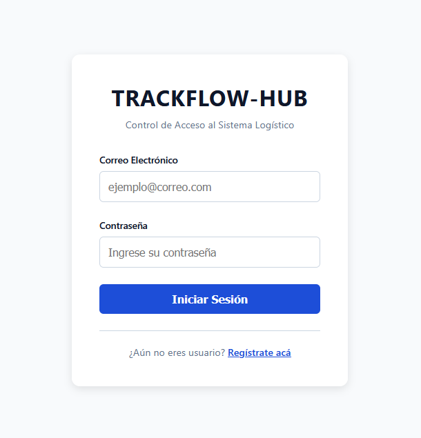

### 1.2 Registro de Usuarios
Aquí los nuevos usuarios pueden crear su cuenta seleccionando el tipo de perfil que desean (Cliente, Operador o Empresa de Transporte). El registro como Administrador es exclusivo desde el panel interno.
Para los operadores y empresas, su cuenta puede requerir un proceso de aprobación por parte del administrador.

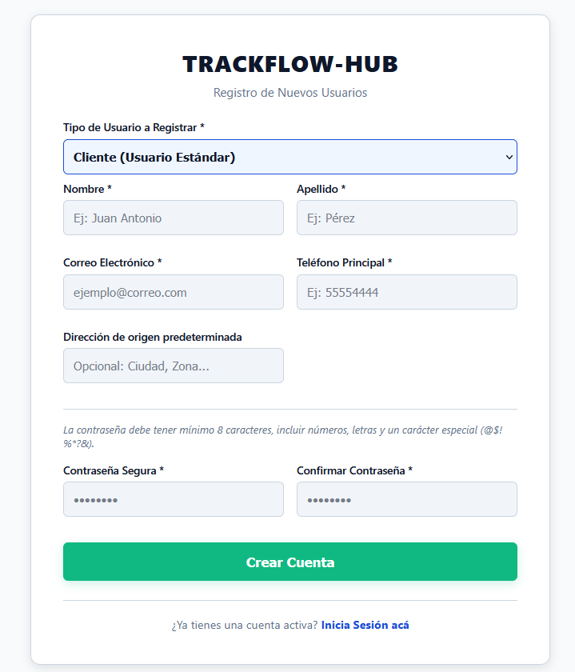

> **Principio Heurístico: Prevención de Errores**
> Durante el registro, el sistema valida que las contraseñas coincidan y que los datos tengan el formato correcto antes de enviar el formulario, reduciendo la probabilidad de cuentas con errores.
> 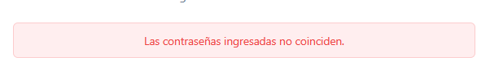

---

## 2. Módulo Clientes

### 2.1 Buscar servicios de envío
El cliente puede realizar búsquedas de servicios de envío por zona, operador o nombre. Cuenta con filtros avanzados (alfabético, calificación, precio, capacidad) para refinar la búsqueda.

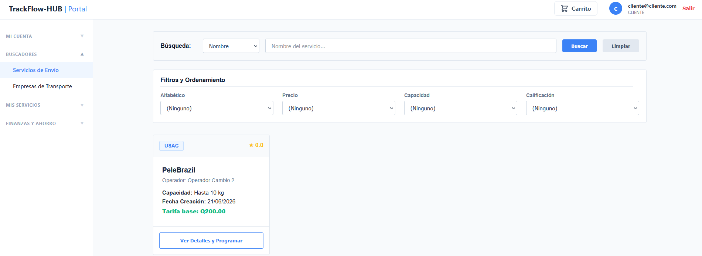

### 2.2 Buscar servicios de transporte
Similar a los envíos, el cliente puede buscar opciones de transporte por destino, fecha y empresa. Los filtros incluyen hora, tiempo estimado, precio y calificación.

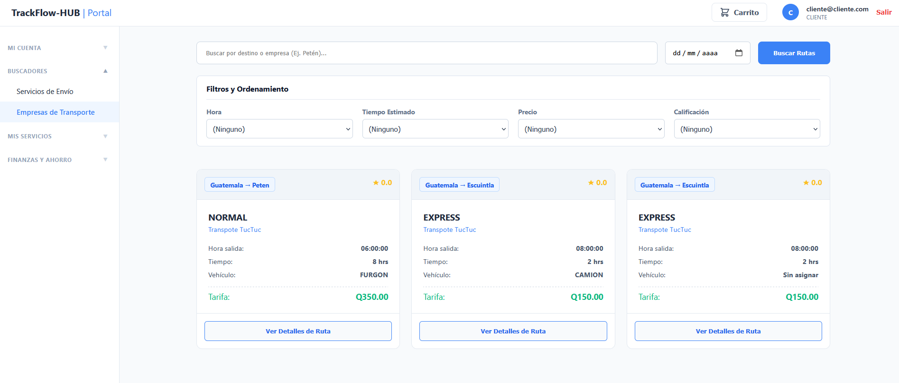

> **Principio Heurístico: Control y Libertad del Usuario**
> El sistema permite al usuario limpiar fácilmente los filtros aplicados o deshacer búsquedas en caso de equivocación, otorgándole control total sobre lo que visualiza.
> 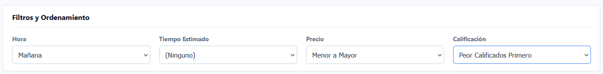

### 2.3 Programar envío y Sugerencias Cruzadas
Al programar un envío, se exige una anticipación mínima de 24 horas y el sistema valida que no existan traslapes con otros envíos ya programados. Al elegir un servicio, el sistema recomienda sugerencias cruzadas (por ejemplo, mostrando los 3 mejores transportes sugeridos).

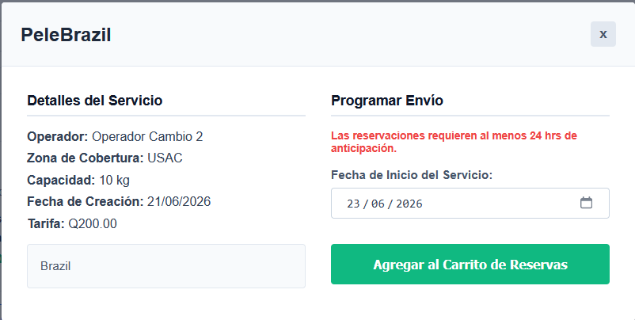

> **Principio Heurístico: Prevención de Errores**
> Si el usuario intenta programar un envío en una fecha/hora no válida (menor a 24h) o que traslapa con otra reservación, el sistema arroja una alerta preventiva clara antes de permitir guardar la acción.
> 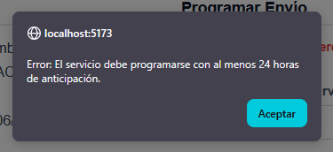

### 2.4 Gestión de pagos y Carrito de compras
El cliente puede agregar servicios al carrito de compras. A la hora de pagar, utiliza una tarjeta simulada o un segundo método de pago.

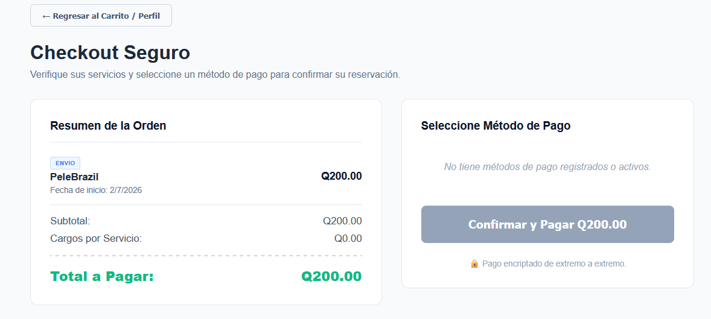

### 2.5 Calificaciones y Comentarios
Una vez finalizada la fecha del servicio o el trayecto, el cliente tiene la opción de evaluar y comentar la calidad del servicio brindado por el operador o la empresa de transporte.

### 2.6 Reportar Problemas
En caso de incidentes, el cliente puede generar un reporte adjuntando evidencias. Además, cuenta con un historial donde puede ver el estado actual de cada uno de sus reportes.

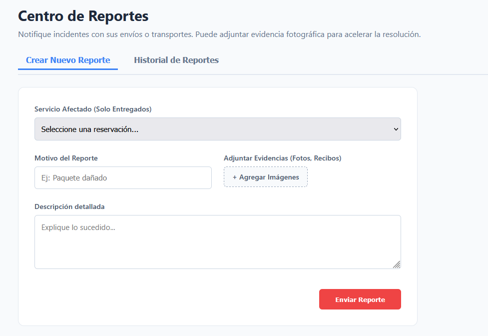

### 2.7 Cancelar Reservación
El sistema permite cancelar una reservación hasta 24 horas antes del servicio, generando un mecanismo de reembolso o devolución.

---

## 3. Módulo de Administrador

### 3.1 Gestión de Registros
El administrador es el encargado de aceptar o rechazar a nuevos operadores logísticos, agendar reuniones para las empresas de transporte y registrar a otros miembros del equipo administrador.

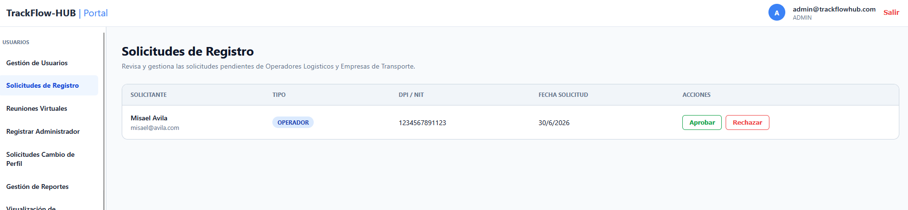

### 3.2 Gestión de Usuarios
Visualización del directorio completo de usuarios filtrados por rol. El administrador puede editar información o vetar usuarios; al vetar, el sistema exige un motivo y notifica automáticamente al usuario por correo.

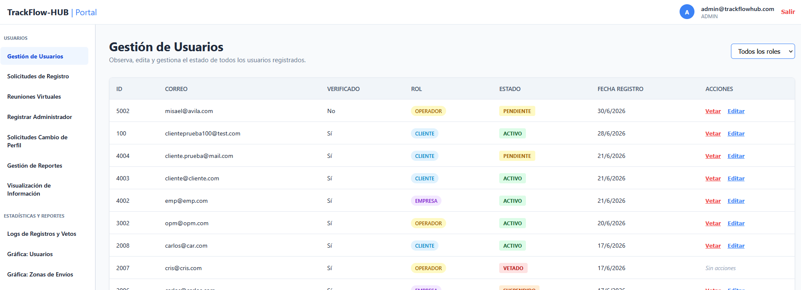

> **Principio Heurístico: Visibilidad del Estado del Sistema**
> Al vetar a un usuario, la tabla se actualiza de inmediato mostrando un indicador de color (rojo) junto al mensaje "Vetado", y lanza una notificación de éxito tras el envío del correo.
> 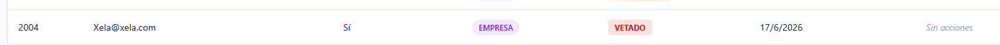
> 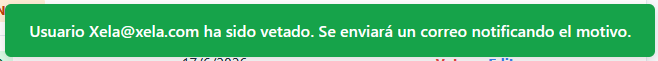

### 3.3 Gestión de Reportes
Permite al administrador revisar todos los reportes generados en el sistema (entre clientes y operadores/empresas) y cambiar su estado en el flujo correspondiente: Enviado, Revisión, Aceptado, Rechazado.

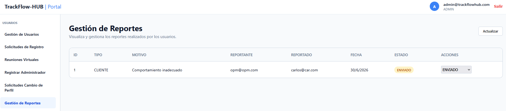

### 3.4 Gestión de Cambios en Perfiles
Los operadores que solicitan modificar datos en su perfil necesitan aprobación. El administrador revisa estas solicitudes, puede aceptarlas o rechazarlas y notifica al usuario de la decisión.

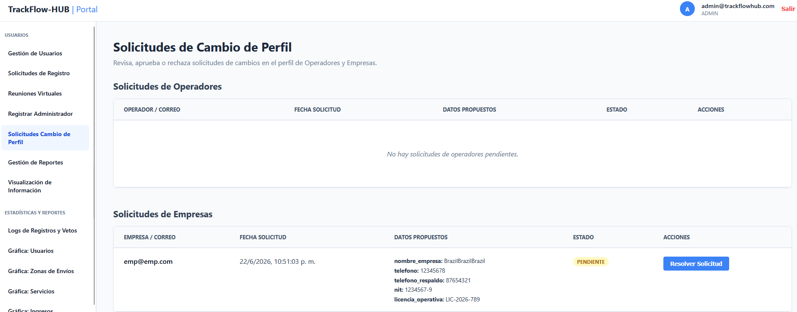

### 3.5 Visualización de Información
Un panel interactivo que resume y lista de manera tabular los servicios activos por zona/empresa, y los envíos realizados por destino/operador.

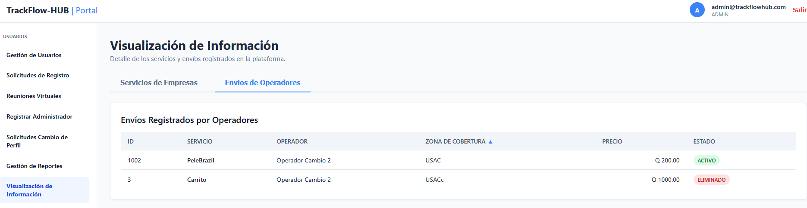

### 3.6 Reportes Estadísticos
Diferentes dashboards y reportes clave del sistema que incluyen ingresos, crecimiento, estados y gráficas de actividad en general.

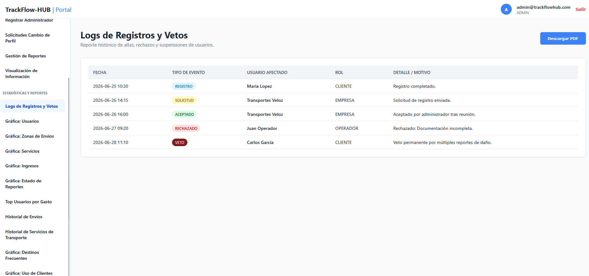

---

## 4. Módulo de Operadores Logísticos

### 4.1 Gestión de Servicios
El operador logístico puede registrar nuevos servicios de envío, modificarlos, eliminarlos o suspenderlos temporalmente del catálogo público.

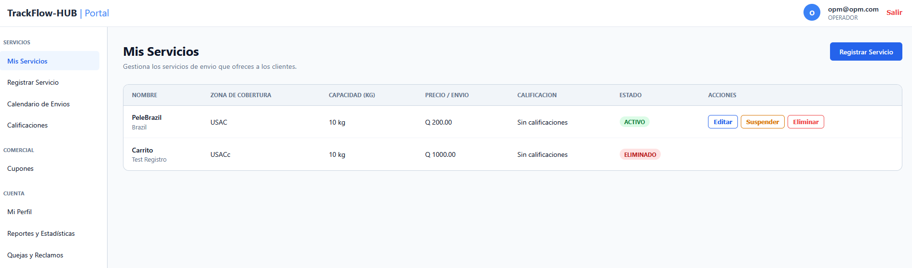

### 4.2 Calificaciones de Clientes
Permite al operador visualizar todas las valoraciones y comentarios que han dejado los clientes respecto a sus envíos, con la opción de emitir una respuesta pública.

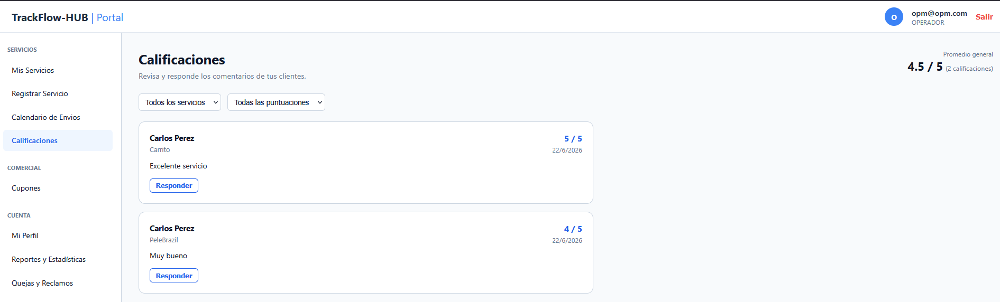

### 4.3 Calendario de Envíos
Vista en formato de calendario que muestra los envíos programados del mes, organizados por día para una rápida visualización individual y general de la agenda.

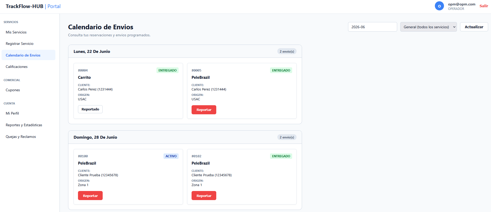

> **Principio Heurístico: Relación entre el Sistema y el Mundo Real**
> Se utiliza una vista de calendario tradicional de pared con formato de días y semanas fácilmente reconocible, en lugar de tablas abstractas de datos de fechas.
> 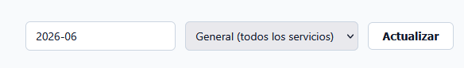

### 4.4 Reportes PDF
El operador puede exportar a PDF información esencial para su negocio: ganancias generadas, historial de clientes y listado de calificaciones.

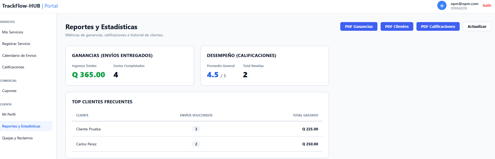

### 4.5 Gestión de Cupones
Permite al operador crear cupones de descuento y asignarlos a clientes específicos de su cartera para fidelizarlos.

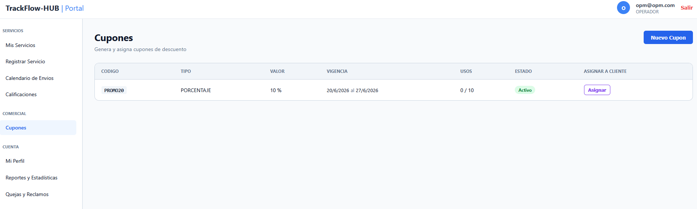

### 4.6 Cambios de Perfil
Si el operador desea cambiar información confidencial, debe ingresar su solicitud en este apartado, la cual será aprobada o rechazada por el Administrador.

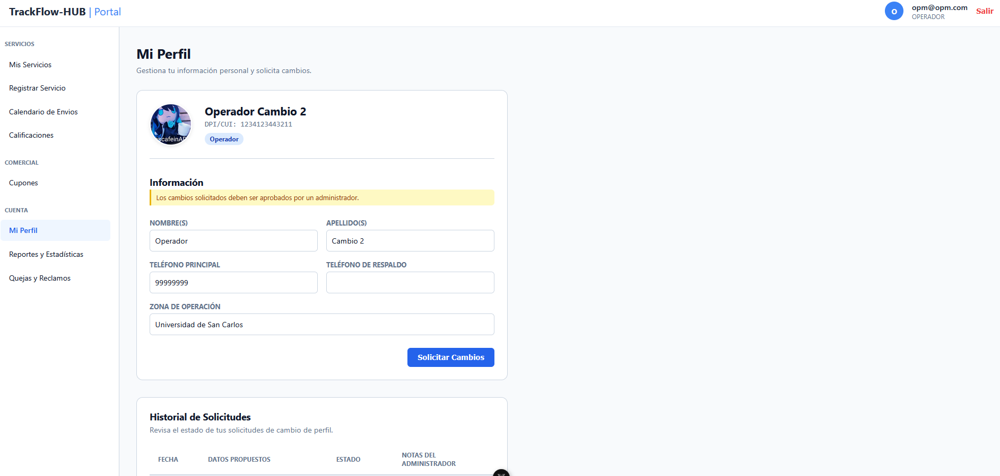

---

## 5. Módulo de Empresas de Transporte

### 5.1 Cargar Flota y Rutas (CSV / Manual)
La empresa puede gestionar toda su flota y trayectos ya sea ingresándolos manualmente en un formulario o subiéndolos de forma masiva mediante un archivo CSV.

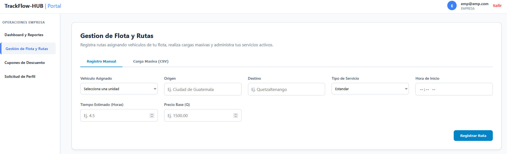

> **Principio Heurístico: Flexibilidad y Eficiencia de Uso**
> Se ofrece la carga vía CSV como "acelerador" para usuarios que necesitan ingresar muchas rutas, manteniendo el formulario manual para cambios simples o usuarios novatos.
> 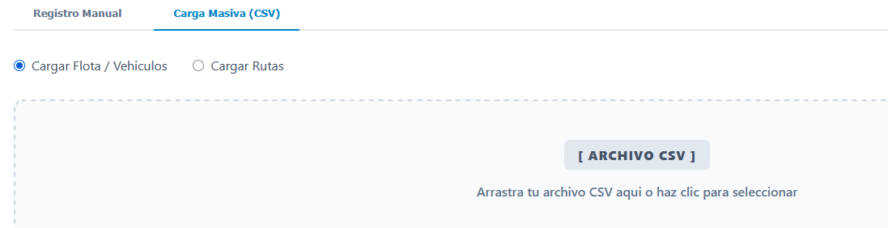

### 5.2 Editar y Suspender Rutas
Cualquier modificación a una ruta individual se refleja de forma inmediata del lado del cliente. Si la empresa necesita cancelar o suspender rutas, se notificará vía correo a los clientes afectados.

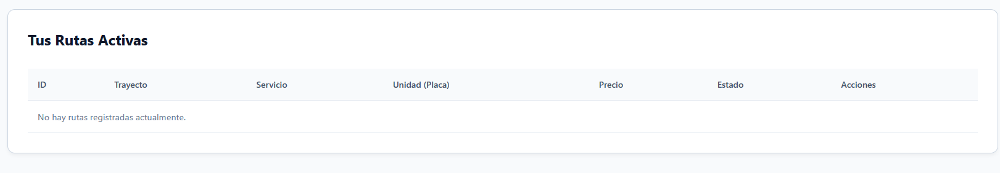

### 5.3 Gestión de Cupones
Similar al operador, la empresa puede generar sus propios descuentos y enviarlos a clientes que usan sus rutas de transporte.

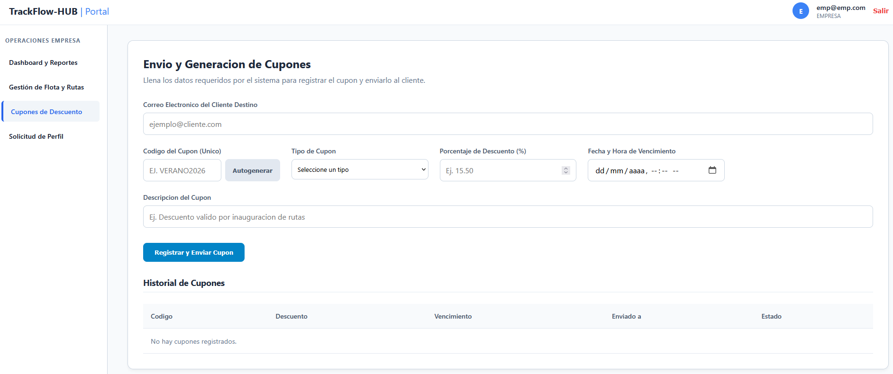

### 5.4 Reportes PDF e Historial
Sección destinada a la impresión de resúmenes de viaje, ingresos por ruta y la visualización de reportes que hayan hecho los clientes sobre las unidades de transporte.

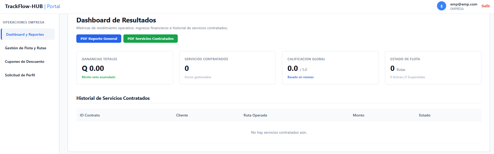
