# Prototipos - TrackFlow Hub

## Descripción
Esta sección contiene los diseños de prototipos de las interfaces de usuario de la aplicación TrackFlow Hub, mostrando los flujos principales para cada tipo de usuario.

---

## 1. Pantalla de Login

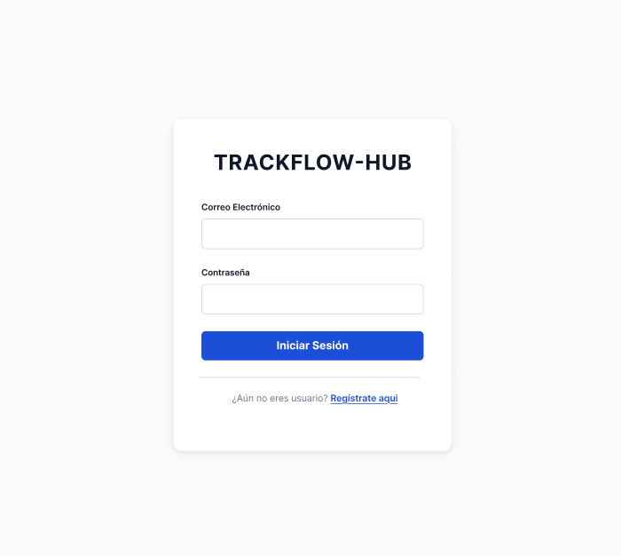

**Descripción:** Pantalla de inicio de sesión principal donde todos los usuarios ingresan sus credenciales.

---

## 2. Registro de Usuarios

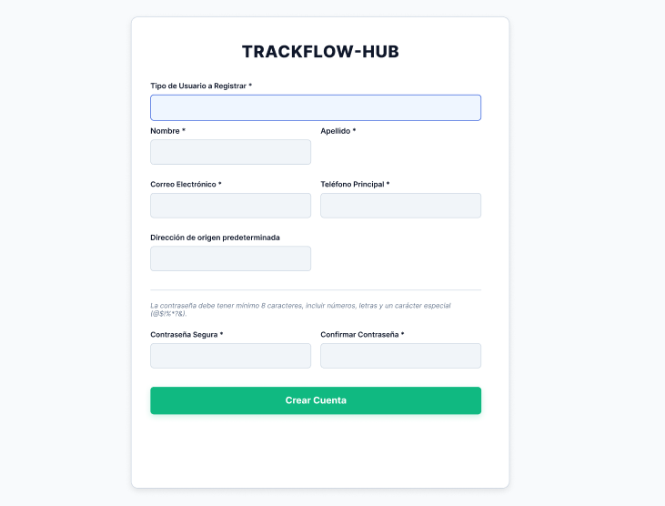

**Descripción:** Formulario de registro para nuevos usuarios del sistema.

---

## 3. Verificación de Token / 2FA

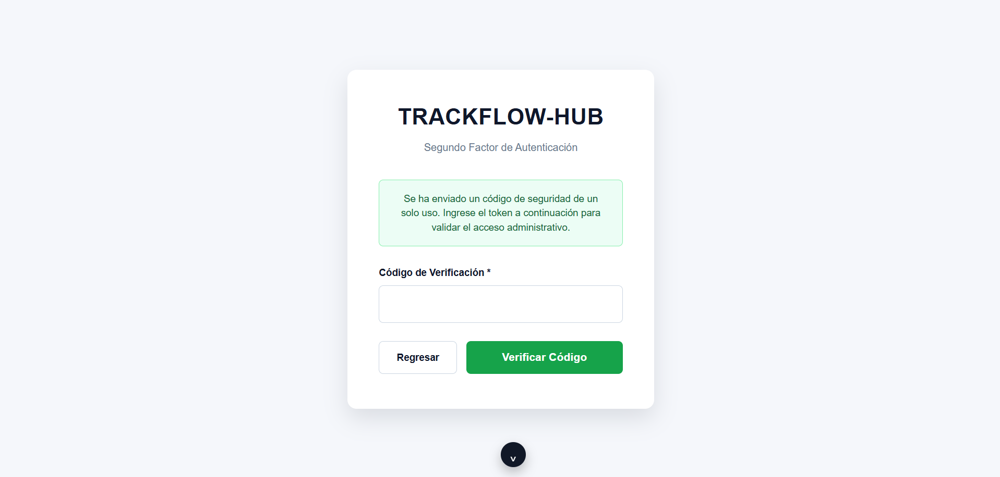

**Descripción:** Pantalla de verificación donde el usuario ingresa el código OTP enviado a su correo electrónico para validar su identidad y completar el inicio de sesión seguro.

---

# Vistas del Administrador

## 4. Dashboard - Administrador

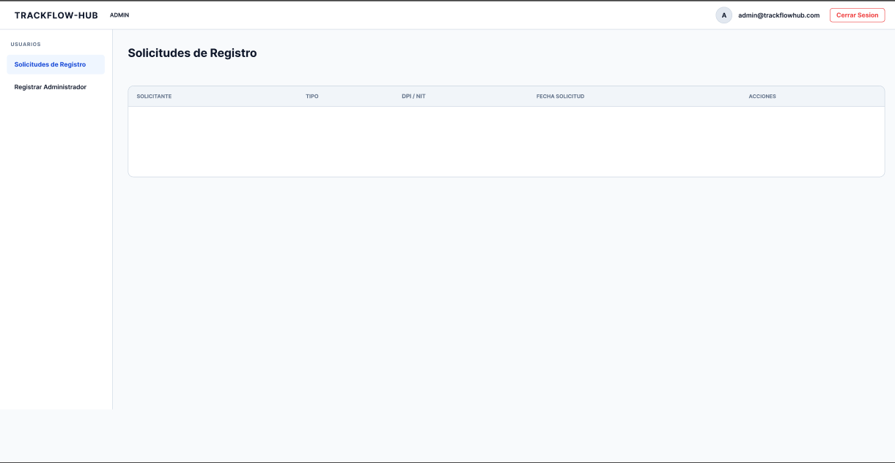

**Descripción:** Panel de control para administradores con acceso a las solicitudes de registro y gestión general del sistema.

---

## 5. Reuniones Virtuales - Administrador

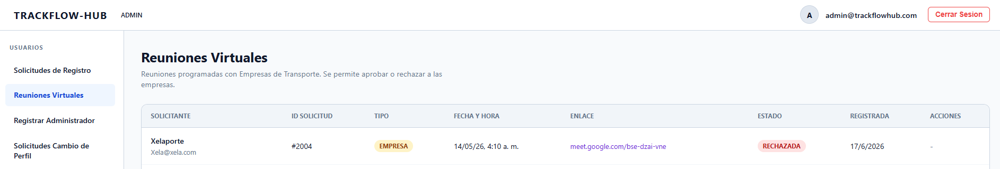

**Descripción:** Panel para agendar reuniones virtuales con empresas de transporte y enviar la información de acceso.

---

## 6. Registrar Administrador

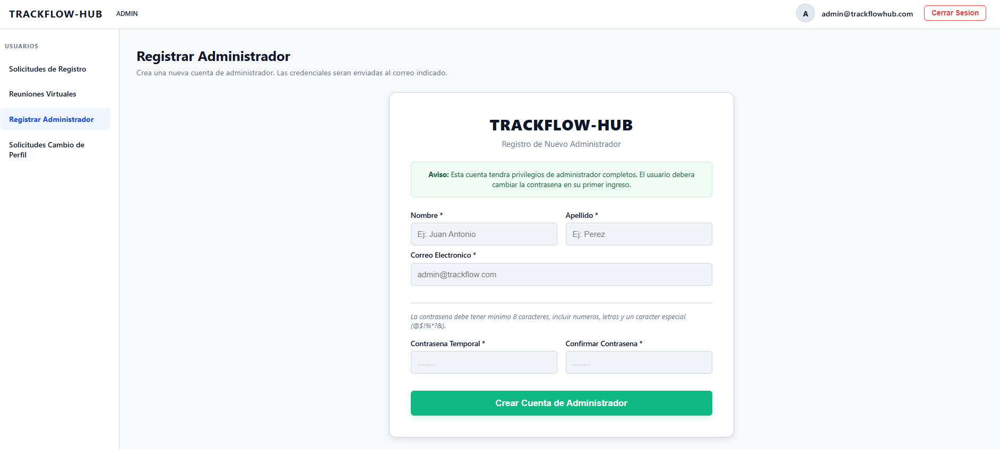

**Descripción:** Formulario para que el administrador registre nuevos administradores en el sistema.

---

## 7. Solicitudes de Cambio de Perfil - Administrador

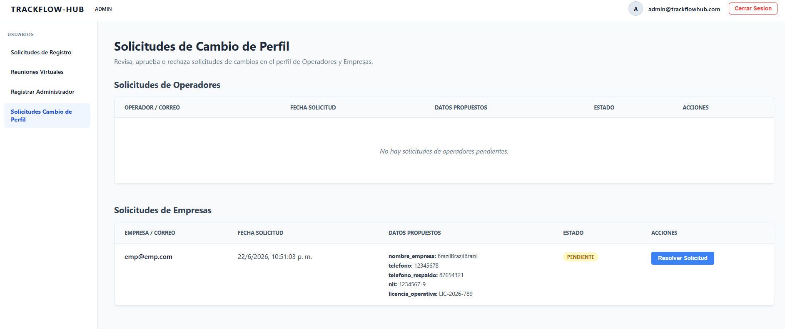

**Descripción:** Interfaz donde el administrador revisa, verifica y aprueba o rechaza los cambios de perfil solicitados por otros usuarios.

---

## 8. Solicitudes de Registro - Administrador

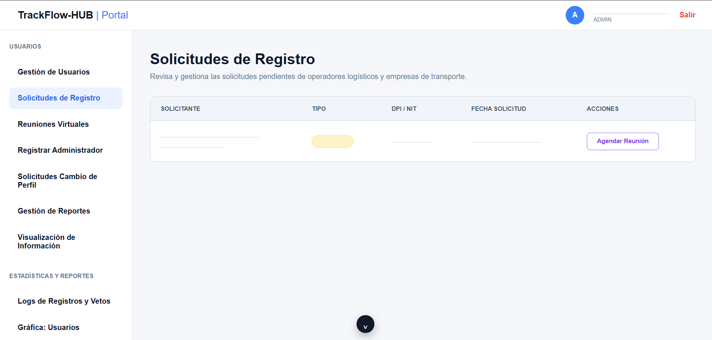

**Descripción:** Panel donde el administrador visualiza el listado de solicitudes pendientes emitidas por Operadores y Empresas, pudiendo aprobar o rechazar su acceso a la plataforma.

---

## 9. Gestión de Usuarios - Administrador

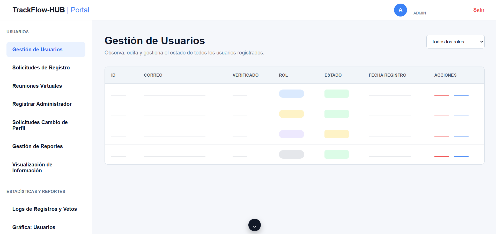

**Descripción:** Listado general de usuarios del sistema (Clientes, Operadores y Empresas) con opciones para gestionar accesos y aplicar vetos a usuarios que incumplan las normas de la plataforma.

---

## 10. Visualización de Información - Administrador

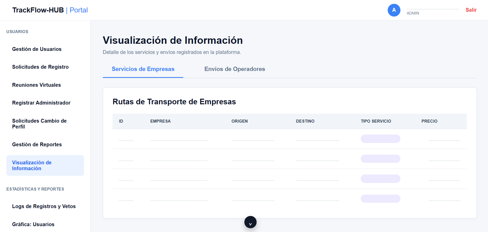

**Descripción:** Vista detallada de los servicios y envíos registrados en la plataforma, incluyendo rutas de transporte de empresas y envíos de operadores.

---

## 11. Gestión de Reportes - Administrador

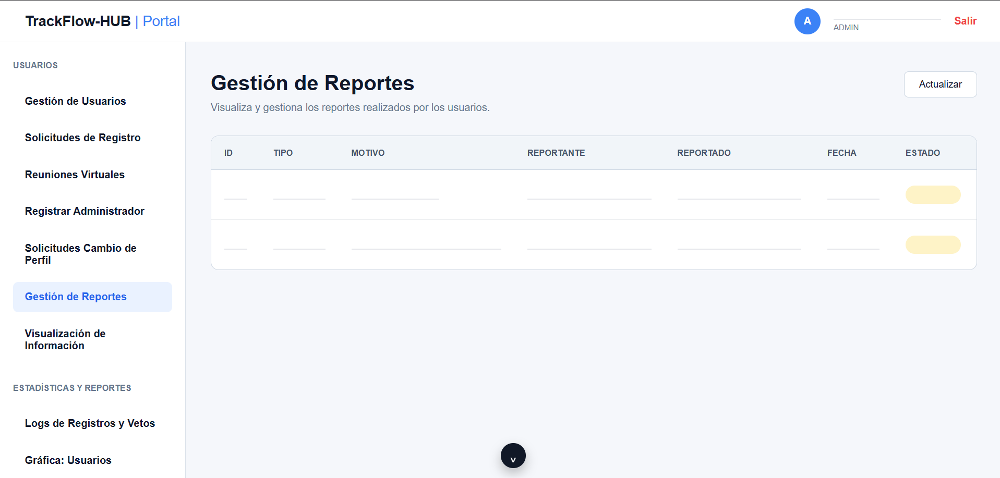

**Descripción:** Panel de gestión de reportes del sistema donde el administrador puede revisar y administrar los reportes generados por los diferentes módulos.

---

## 12. Reportes y Estadísticas - Administrador

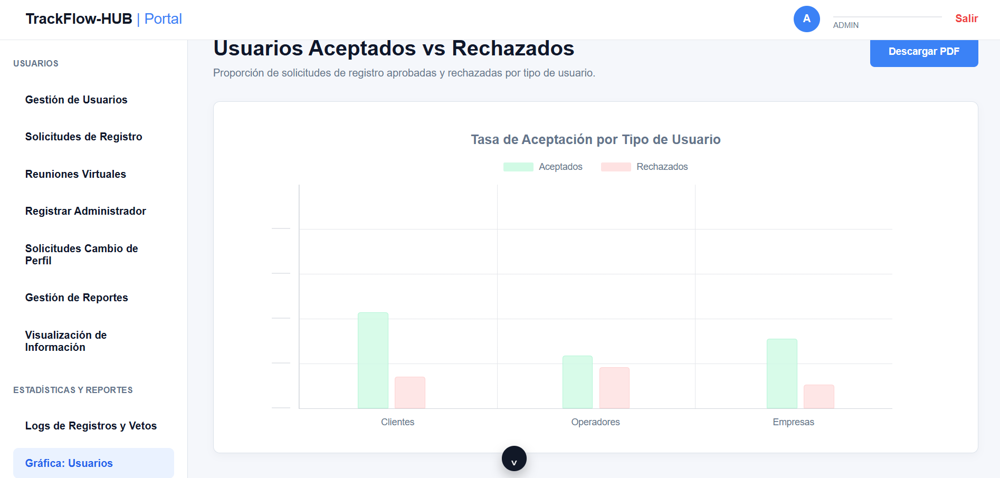

**Descripción:** Dashboard de métricas avanzadas con gráficas estadísticas basadas en ingresos, comisiones, operaciones y solicitudes del sistema.

---

## 13. Historial de Envíos - Administrador

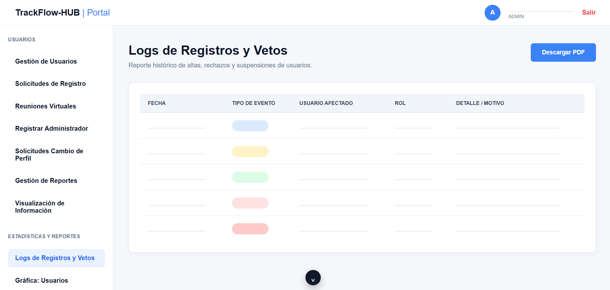

**Descripción:** Vista de historial consolidado de envíos realizados en la plataforma con filtros y opciones de descarga en PDF.

---

## 14. Top Usuarios por Gasto - Administrador

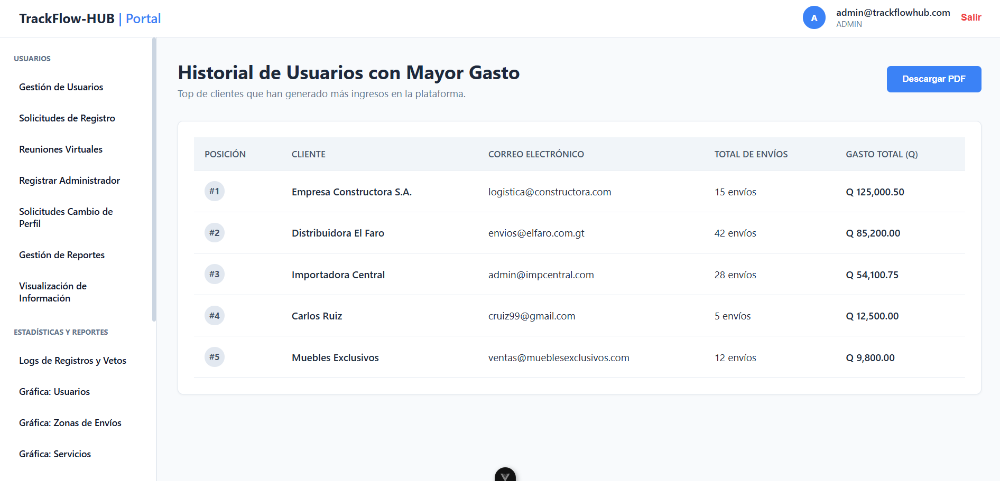

**Descripción:** Rankings de usuarios con mayor gasto en la plataforma, permitiendo al administrador monitorear el comportamiento comercial del sistema.

---

# Vistas de la Empresa de Transporte

## 15. Dashboard - Empresa de Transporte

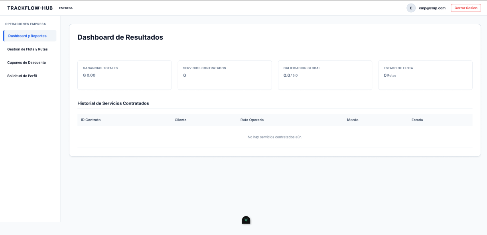

**Descripción:** Panel de control para empresas de transporte con opciones de gestión de flota y operaciones.

---

## 16. Dashboard y Reportes - Empresa de Transporte

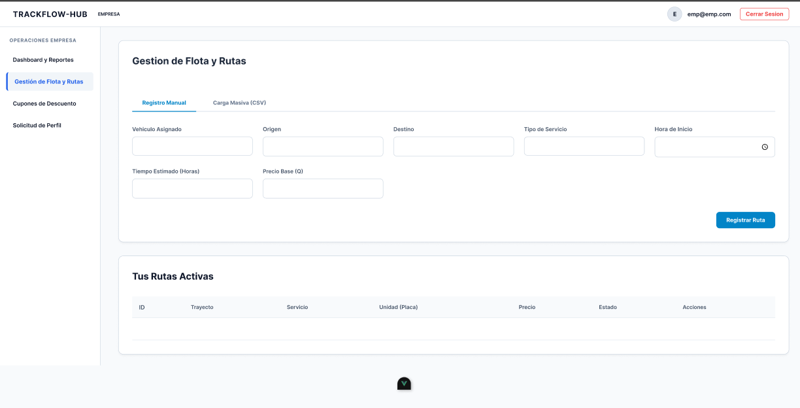

**Descripción:** Panel de control detallado para empresas de transporte con acceso a reportes de ganancias, historial y estadísticas operativas.

---

## 17. Gestión de Flota y Rutas - Empresa de Transporte

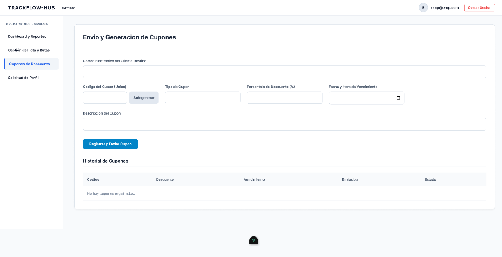

**Descripción:** Módulo para registrar, editar y gestionar la flota de vehículos y las rutas de transporte de la empresa.

---

## 18. Cupones de Descuento - Empresa de Transporte

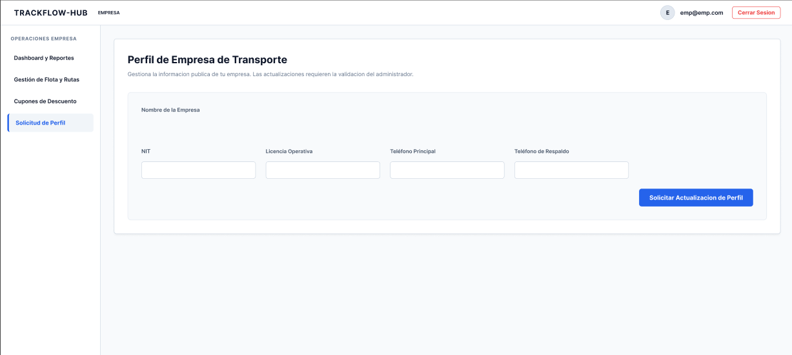

**Descripción:** Herramienta para generar y gestionar cupones de descuento por temporada para los clientes de la empresa.

---

## 19. Calendario - Empresa de Transporte

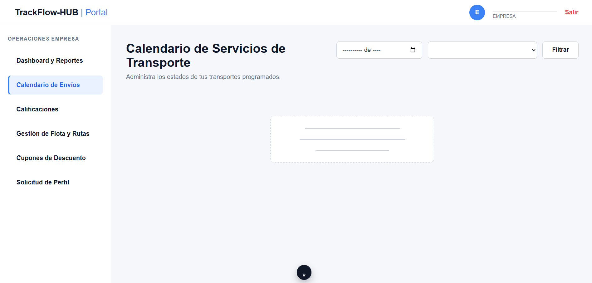

**Descripción:** Vista de calendario donde la empresa de transporte puede visualizar las fechas programadas de envíos y gestionar la disponibilidad de su flota.

---

## 20. Calificaciones - Empresa de Transporte

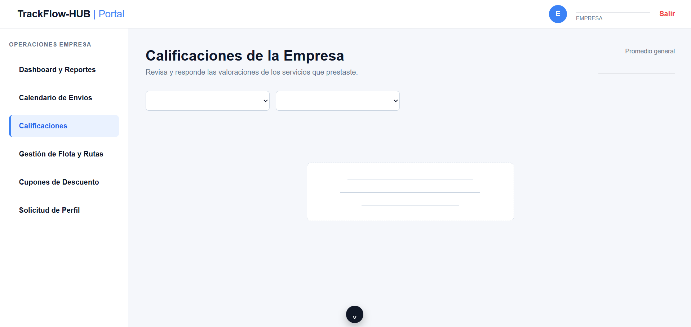

**Descripción:** Sección donde la empresa puede visualizar y responder a las calificaciones y reseñas dejadas por los clientes sobre sus servicios de transporte.

---

## 21. Mi Perfil - Empresa de Transporte

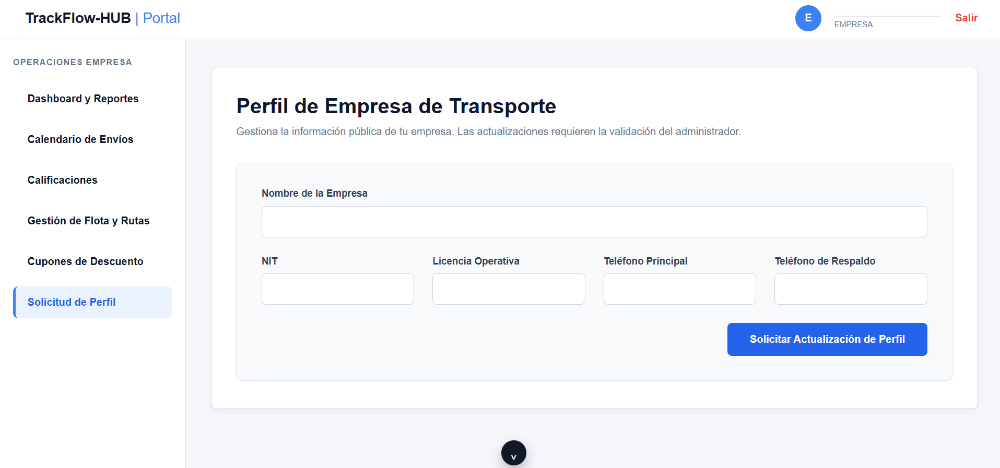

**Descripción:** Sección donde la empresa de transporte puede visualizar su información comercial y solicitar cambios en su perfil al administrador.

---

# Vistas del Operador Logístico

## 22. Dashboard - Operador Logístico

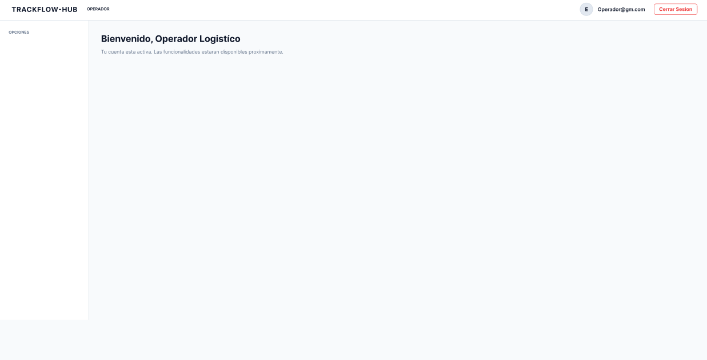

**Descripción:** Panel de control inicial para operadores logísticos.

---

## 23. Mis Servicios - Operador Logístico

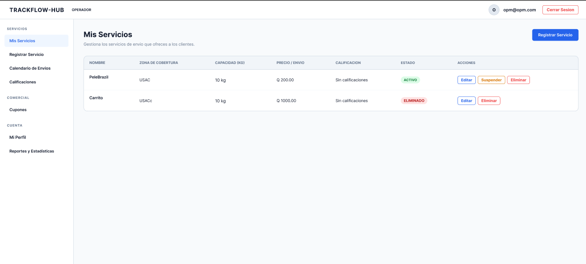

**Descripción:** Panel donde el operador logístico puede gestionar, modificar, eliminar o suspender temporalmente sus servicios de envío.

---

## 24. Registrar Servicio - Operador Logístico

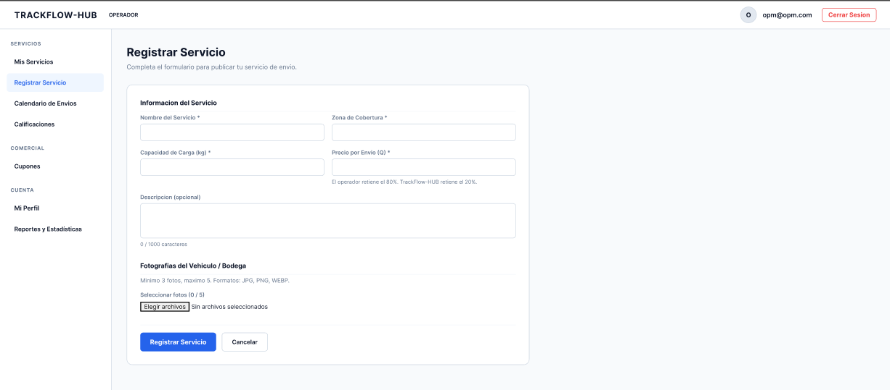

**Descripción:** Formulario para que el operador logístico registre nuevos servicios de envío detallando zona de cobertura, capacidad y precio.

---

## 25. Calendario de Envíos - Operador Logístico

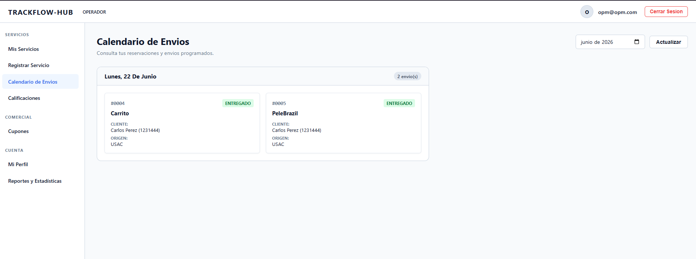

**Descripción:** Vista de calendario que muestra las fechas programadas por los clientes para los servicios de envío.

---

## 26. Calificaciones - Operador Logístico

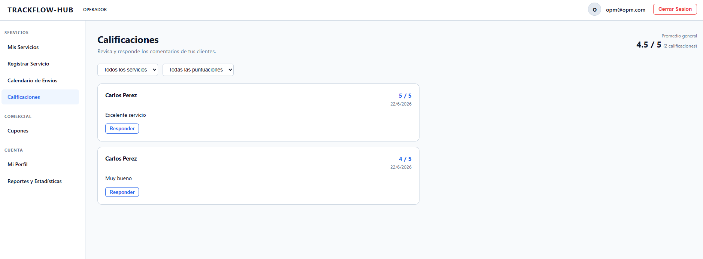

**Descripción:** Sección donde el operador puede visualizar y responder a las calificaciones y reseñas dejadas por los clientes.

---

## 27. Cupones - Operador Logístico

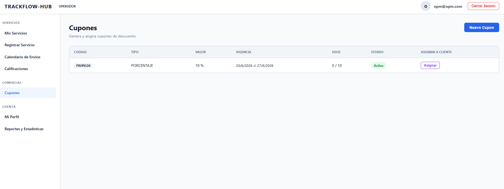

**Descripción:** Interfaz para que el operador logístico genere cupones o códigos de descuento especiales para sus clientes.

---

## 28. Mi Perfil - Operador Logístico

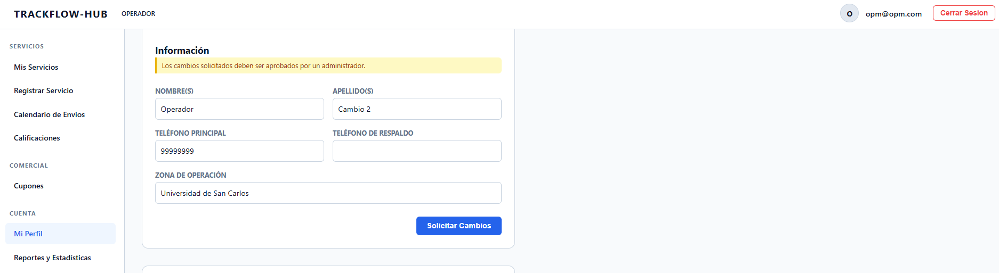

**Descripción:** Sección donde el operador logístico puede visualizar su información y solicitar cambios en su perfil al administrador.

---

## 29. Reportes y Estadísticas - Operador Logístico

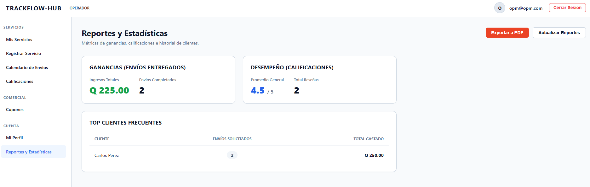

**Descripción:** Panel para visualizar el historial de clientes, reportes de calificaciones y descargar en PDF las ganancias generadas.

---

# Vistas del Cliente

## 30. Mi Perfil - Cliente

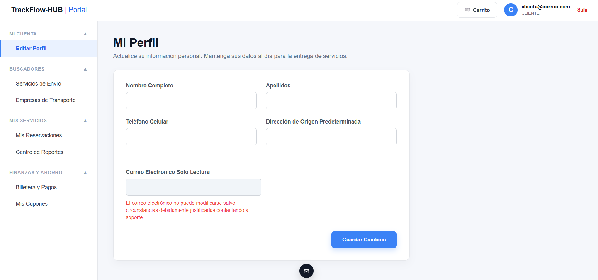

**Descripción:** Sección donde el cliente puede actualizar su información personal, incluyendo nombre, apellidos, teléfono y dirección de origen predeterminada.

---

## 31. Buscar Servicios de Envío - Cliente

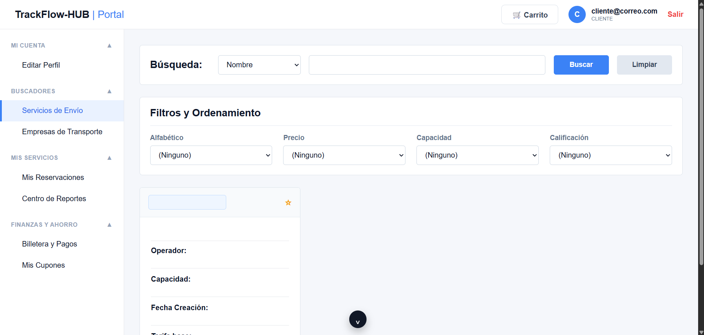

**Descripción:** Motor de búsqueda y cotización donde el cliente ingresa la ubicación de recolección, destino y peso del paquete para obtener opciones de envío con tarifas de operadores logísticos.

---

## 32. Buscar Empresas de Transporte - Cliente

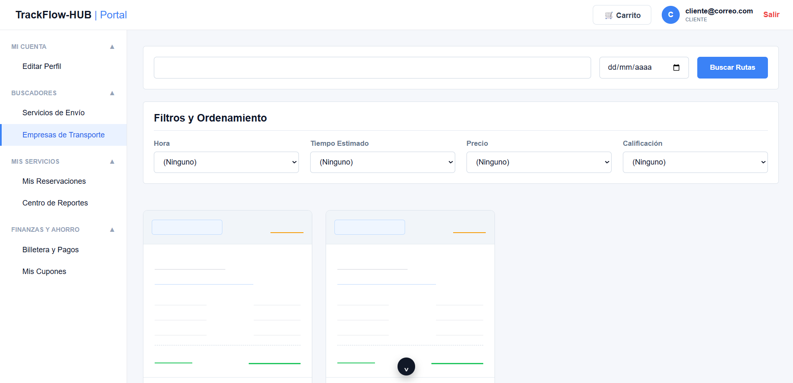

**Descripción:** Buscador de servicios ofrecidos por empresas de transporte, mostrando rutas disponibles, tarifas y opciones para añadir al carrito.

---

## 33. Mis Reservaciones - Cliente

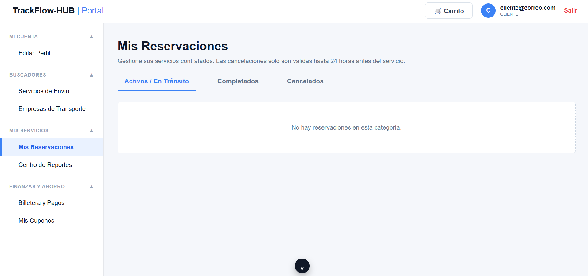

**Descripción:** Panel donde el cliente puede visualizar el historial y estado de todos sus envíos contratados, con opciones de seguimiento y calificación de servicios finalizados.

---

## 34. Billetera y Pagos - Cliente

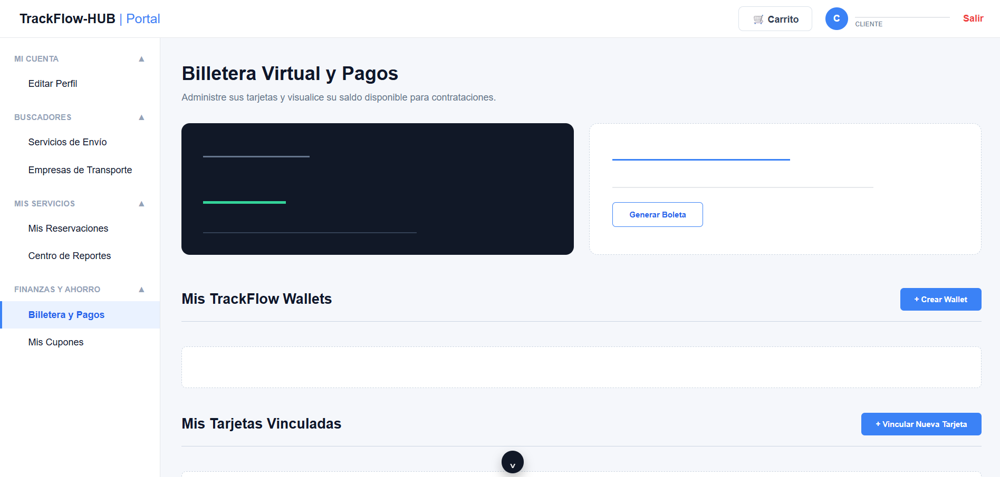

**Descripción:** Módulo de gestión financiera donde el cliente puede administrar sus métodos de pago, visualizar su saldo y realizar el checkout de sus envíos.

---

## 35. Mis Cupones - Cliente

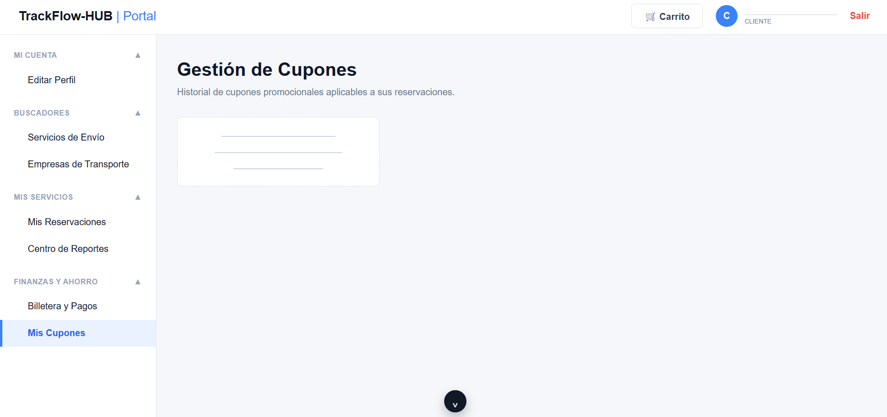

**Descripción:** Sección donde el cliente puede visualizar y aplicar cupones de descuento disponibles para sus próximas contrataciones de servicios.

---

## 36. Carrito de Envíos - Cliente

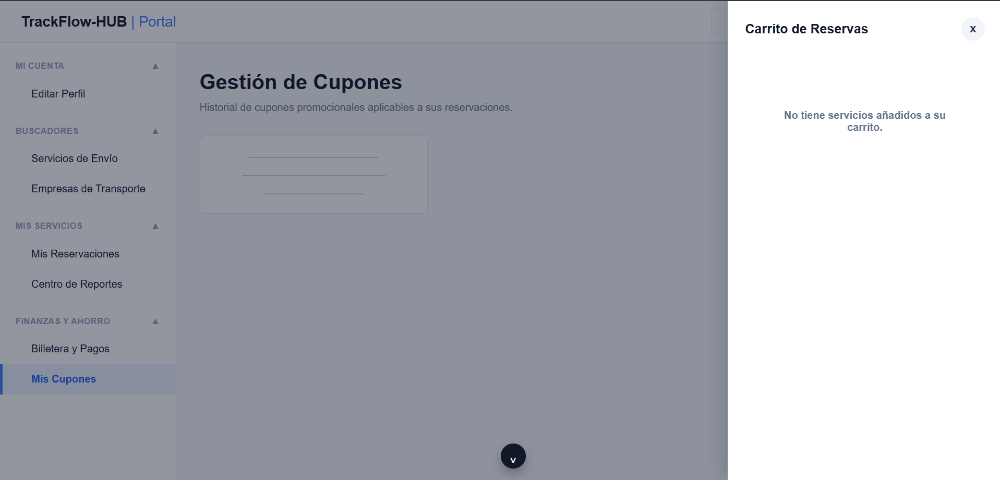

**Descripción:** Carrito de compras donde el cliente almacena temporalmente los servicios de envío seleccionados, puede aplicar cupones de descuento y proceder al pago conjunto.

---

## Notas Adicionales

- Los prototipos representan el estado final esperado de las interfaces
- Cada rol tiene un dashboard personalizado según sus funcionalidades
- La navegación es consistente entre todas las pantallas
- Se utiliza un esquema de colores coherente para mejor experiencia de usuario
- El sistema cuenta con 4 roles principales: Administrador, Empresa de Transporte, Operador Logístico y Cliente