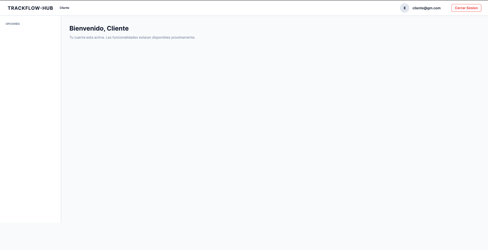

# Prototipos - TrackFlow Hub

## Descripción
Esta sección contiene los diseños de prototipos de las interfaces de usuario de la aplicación TrackFlow Hub, mostrando los flujos principales para cada tipo de usuario.

---

## 1. Pantalla de Login

**Descripción:** Pantalla de inicio de sesión principal donde todos los usuarios ingresan sus credenciales.

---

## 2. Registro de Usuarios

**Descripción:** Formulario de registro para nuevos usuarios del sistema.

---

## 3. Dashboard - Administrador

**Descripción:** Panel de control para administradores con acceso a las solicitudes de registro y gestión general del sistema.

---

## 4. Dashboard - Cliente

**Descripción:** Panel de control para clientes donde pueden acceder a sus solicitudes y servicios.

---

## 5. Dashboard - Operador Logístico

**Descripción:** Panel de control para operadores logísticos con funcionalidades de seguimiento y gestión de envíos.

---

## 6. Dashboard - Empresa de Transporte

**Descripción:** Panel de control para empresas de transporte con opciones de gestión de flota y operaciones.

---

## Notas Adicionales

- Los prototipos representan el estado final esperado de las interfaces
- Cada rol tiene un dashboard personalizado según sus funcionalidades
- La navegación es consistente entre todas las pantallas
- Se utiliza un esquema de colores coherente para mejor experiencia de usuario
