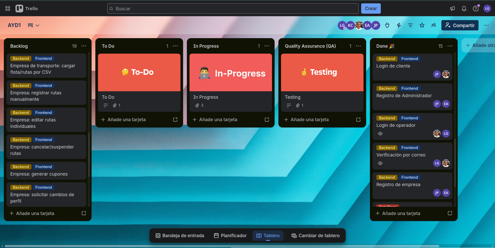
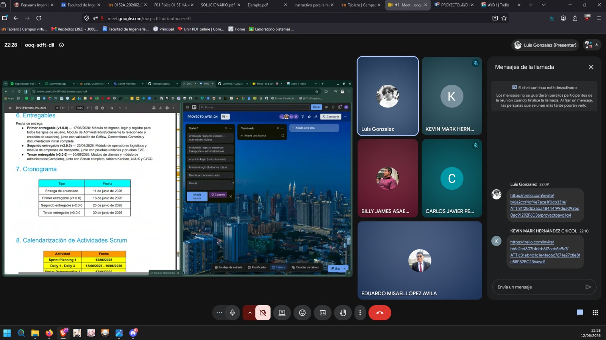
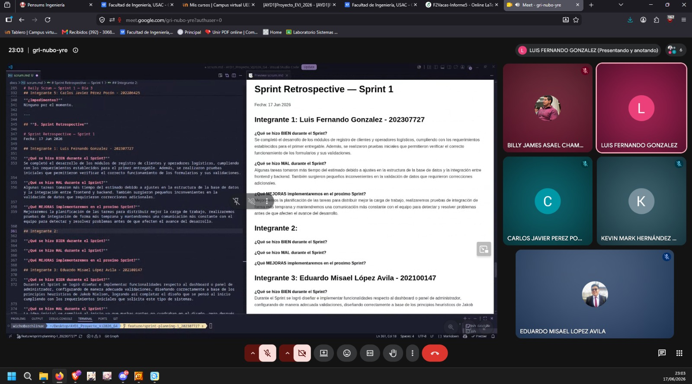

# **SCRUM**
## **1. Creacion de Product Backlog:**

[Tablero](https://trello.com/invite/b/6a2cd807bfdeb612aeb5c9a7/ATTI652b2e578fae0edca261724193a917beB5291EB6/ayd1)

## **2. Sprint Planning**

#### **Datos de la Reunion:** 

- Fecha: 12/06/2026
- Duracion: 2 Horas
- Plataforma: Google Meet
- Fin Sprint: 17/06/2026

---

#### **Roles Presentes:**
- **Scrum Master:** Luis Fernando Gonzalez - 202307727
- **Product Owner:** Kevin Mark Hernández Chicol - 202001053
- **Dev Team:** 
    - Carlos Javier Pérez Pocón - 202206425
    - Eduardo Misael López Avila - 202100147
    - Billy James Asael Chamale Sanchez - 201907502
---

## **3. Sprint Backlog**

#### **Story Points Comprometidos:**

### HU-01
**Como** cliente, **quiero** registrarme con mis datos personales, **para** poder acceder a la plataforma y utilizar sus servicios.
 
**Criterios de aceptación:**
- El formulario solicita nombre, apellido, teléfono, correo electrónico, contraseña (con confirmación) y dirección de origen predeterminada.
- La contraseña debe cumplir reglas de seguridad mínimas y confirmarse dos veces.
- Al completar el registro se envía automáticamente un correo con un token de verificación de 6 caracteres.
**Story Points:** 5
**Prioridad:** Alta
 
---
 
### HU-02
**Como** cliente, **quiero** verificar mi cuenta con el token enviado a mi correo, **para** poder iniciar sesión en la plataforma.
 
**Criterios de aceptación:**
- El token se solicita inmediatamente después del registro.
- El token se vuelve a solicitar en cualquier intento de inicio de sesión mientras la cuenta no esté verificada.
- El sistema valida que el token ingresado corresponda al enviado.
**Story Points:** 3
**Prioridad:** Alta
 
---
 
### HU-03
**Como** operador logístico, **quiero** registrarme con mi información verificable, **para** solicitar mi acceso a la plataforma.
 
**Criterios de aceptación:**
- El formulario solicita nombre, apellido, DPI/CUI, teléfono, teléfono de respaldo (opcional), correo, fotografía, zona de operación y género.
- Se valida el formato del DPI/CUI y del correo electrónico.
**Story Points:** 5
**Prioridad:** Alta
 
---
 
### HU-04
**Como** operador logístico, **quiero** que mi solicitud pase por revisión del administrador, **para** poder ingresar a la plataforma una vez aceptado.
 
**Criterios de aceptación:**
- Tras verificar el correo, el perfil queda en estado "en revisión" y se notifica al operador.
- Si es aceptado, recibe una contraseña temporal que debe cambiar en su primer ingreso.
- Si es rechazado, recibe una notificación indicando el motivo.
**Story Points:** 5
**Prioridad:** Alta
 
---
 
### HU-05
**Como** empresa de transporte, **quiero** registrarme con mi información verificable, **para** iniciar el proceso de aprobación ante el administrador.
 
**Criterios de aceptación:**
- El formulario solicita nombre de la empresa, teléfono, teléfono de respaldo (opcional), correo, NIT y número de licencia operativa.
**Story Points:** 3
**Prioridad:** Alta
 
---
 
### HU-06
**Como** empresa de transporte, **quiero** que se agende una reunión virtual con el administrador, **para** presentar mi propuesta de servicios y obtener acceso a la plataforma.
 
**Criterios de aceptación:**
- El administrador puede observar las solicitudes pendientes de empresas de transporte.
- El administrador agenda fecha, hora y enlace, y la información se envía al correo de la empresa.
- Tras la aprobación de la reunión, el administrador entrega credenciales de acceso especiales.
**Story Points:** 5
**Prioridad:** Alta
 
---
 
### HU-07
**Como** administrador, **quiero** iniciar sesión con doble factor de autenticación, **para** proteger el acceso al panel administrativo.
 
**Criterios de aceptación:**
- Tras ingresar la contraseña correcta, se envía un token al correo con vigencia de 2 minutos.
- El inicio de sesión solo se completa si el token es válido y no ha expirado.
**Story Points:** 5
**Prioridad:** Alta
 
---
 
### HU-08
**Como** administrador, **quiero** gestionar las solicitudes de registro de operadores logísticos, **para** aceptar o rechazar su ingreso a la plataforma.
 
**Criterios de aceptación:**
- Existe un listado de solicitudes pendientes de operadores logísticos.
- El administrador puede aceptar (genera contraseña temporal y notifica) o rechazar (notifica el motivo) cada solicitud.
**Story Points:** 5
**Prioridad:** Alta
 
---
 
### HU-09
**Como** administrador, **quiero** observar las solicitudes de empresas de transporte y agendar reuniones virtuales, **para** validar su ingreso a la plataforma.
 
**Criterios de aceptación:**
- Existe un listado de solicitudes pendientes de empresas de transporte.
- El administrador puede definir fecha, hora y enlace de la reunión, y enviarlos por correo a la empresa.
**Story Points:** 5
**Prioridad:** Alta
 
---
 
### HU-10
**Como** administrador, **quiero** registrar nuevos administradores desde el panel de administración, **para** delegar funciones administrativas dentro del sistema.
 
**Criterios de aceptación:**
- La opción solo es accesible desde el panel de administración (no es un registro público).
- Los campos del formulario quedan definidos por el equipo de desarrollo.
**Story Points:** 3
**Prioridad:** Media

---

#### **Decisiones tecnicas**
- Framework Frontend: Vue
- Framework Backend: Express
- Base de datos: SQL SERVER
- Algoritmo de encriptacion: crypt
- Herramientas kanban: Trello

---

#### **Sprint Goal**
Al finalizar el Sprint 1, TrackFlow-HUB debe tener el módulo de **registro e ingreso** completo y funcional para los cuatro tipos de usuario (clientes, operadores logísticos, empresas de transporte y administradores, este último con 2FA), el **módulo de administrador limitado a la gestión de solicitudes de registro** (aceptar/rechazar operadores, agendar reuniones con empresas de transporte), la estrategia **Gitflow** y **Conventional Commits** correctamente configuradas, y la **documentación inicial** del proyecto completa.

---

## **4. Daily Scrum** 

# Daily Scrum — Sprint 1 — Día 1
Fecha: 14 Jun 2026 

## Integrante 1: Luis Fernando Gonzalez - 202307727

**¿Qué hice ayer?**
Analicé los requerimientos del proyecto y comencé la implementación del módulo de registro de clientes. Definí la estructura de datos necesaria para almacenar la información solicitada en el formulario de registro.

**¿Qué haré hoy?**
Continuaré con el desarrollo del registro de clientes, implementando las validaciones de campos obligatorios y la confirmación de contraseña.

**¿Impedimentos?**
Ninguno por el momento.

## Integrante 2: Billy James Asael Chamale Sanchez - 201907502

**¿Qué hice ayer?**
Organizare las carpetas para implementar el Frontend

**¿Qué haré hoy?**
Creare los archivos.vue y css del login,de los registros, Sidebar, y upperbar

**¿Impedimentos?**
Ninguno por el momento.

## Integrante 3: Eduardo Misael López Avila - 202100147

**¿Qué hice ayer?**
Definí la idea visual para el dashboard de administrador

**¿Qué haré hoy?**
Organizare las carpetas y utilidades necesarias para inicializar el dashboard de administrador

**¿Impedimentos?**
Ninguno por el momento.

## Integrante 4: Kevin Mark Hernández Chicol - 202001053

**¿Qué hice ayer?**
No se realizaron actividades previas, ya que este es el inicio del Sprint.

**¿Qué haré hoy?**
Analicé los requerimientos del sistema y definí la estructura inicial de la base de datos.

**¿Impedimentos?**
Ninguno por el momento.

## Integrante 5: Carlos Javier Pérez Pocón - 202206425

**¿Qué hice ayer?**
Revisé los requisitos del módulo que me tocó administrador y registros y el modelo de la base de datos para entender bien las tablas.

**¿Qué haré hoy?**
Empezaré el backend del registro de empresas de transporte y la conexión con la base de datos.

**¿Impedimentos?**
Ninguno por el momento.

---

# Daily Scrum — Sprint 1 — Día 2
Fecha: 15 Jun 2026 

## Integrante 1: Luis Fernando Gonzalez - 202307727

**¿Qué hice ayer?**
Analicé los requerimientos del proyecto y comencé la implementación del módulo de registro de clientes. Definí la estructura de datos necesaria para almacenar la información solicitada en el formulario de registro.

**¿Qué haré hoy?**
Continuaré con el desarrollo del registro de clientes, implementando las validaciones de campos obligatorios y la confirmación de contraseña.

**¿Impedimentos?**
Ninguno por el momento.

## Integrante 2: Billy James Asael Chamale Sanchez - 201907502

**¿Qué hice ayer?**
Creare los archivos.vue y css del login,de los registros, Sidebar, y upperbar

**¿Qué haré hoy?**
Colocare los endpoints y realizare pruebas a los registros

**¿Impedimentos?**
Ninguno por el momento.

## Integrante 3: Eduardo Misael López Avila - 202100147

**¿Qué hice ayer?**
Organicé las carpetas y utilidades para comenzar a inicializar el dashboard de administrador

**¿Qué haré hoy?**
Comenzaré a implementar diseño y código para las bases necesarias del dashboard de administrador y sus modulos

**¿Impedimentos?**
Ninguno por el momento.

## Integrante 4: Kevin Mark Hernández Chicol - 202001053

**¿Qué hice ayer?**
Analicé los requerimientos del sistema y definí la estructura inicial de la base de datos.

**¿Qué haré hoy?**
Elaboraré el script de creación de la base de datos e iniciaré la configuración del entorno mediante Docker.

**¿Impedimentos?**
Ninguno por el momento.

## Integrante 5: Carlos Javier Pérez Pocón - 202206425

**¿Qué hice ayer?**
Empecé el backend del registro de empresas de transporte y la conexión con la base de datos.

**¿Qué haré hoy?**
Terminaré el registro de empresa y haré el login de empresa que solo entre si está verificada y aprobada, y de paso arreglaré el login de cliente.

**¿Impedimentos?**
Ninguno por el momento.

---

# Daily Scrum — Sprint 1 — Día 3
Fecha: 16 Jun 2026 

## Integrante 1: Luis Fernando Gonzalez - 202307727

**¿Qué hice ayer?**
Desarrollé el formulario de registro para operadores logísticos e integré los campos requeridos, incluyendo información personal, zona de operación y carga de fotografía.

**¿Qué haré hoy?**
Realizaré pruebas de funcionamiento de los módulos de registro de clientes y operadores, además de corregir errores encontrados durante las pruebas.

**¿Impedimentos?**
Se presentaron algunos ajustes menores en la validación de datos, pero fueron resueltos y no afectan el avance del sprint.

## Integrante 2: Billy James Asael Chamale Sanchez - 201907502

**¿Qué hice ayer?**
Analice y diseñe el login

**¿Qué haré hoy?**
Organizare las carpetas para implementar el Frontend

**¿Impedimentos?**
Ninguno por el momento.

## Integrante 3: Eduardo Misael López Avila - 202100147

**¿Qué hice ayer?**
Implementé el diseño y código para las bases necesarias del dashboard de administrador y sus módulos.

**¿Qué haré hoy?**
Implementaré correcciones y funcionalidades necesarias faltantes para el correcto funcionamiento final del dashboard de administrador y sus modulos

**¿Impedimentos?**
Ninguno por el momento.

## Integrante 4: Kevin Mark Hernández Chicol - 202001053

**¿Qué hice ayer?**
Elaboraré el script de creación de la base de datos e iniciaré la configuración del entorno mediante Docker.

**¿Qué haré hoy?**
Documentaré los Requerimientos Funcionales (RF), Requerimientos No Funcionales (RNF) y los Casos de Uso del sistema.

**¿Impedimentos?**
Ninguno por el momento.

## Integrante 5: Carlos Javier Pérez Pocón - 202206425

**¿Qué hice ayer?**
Terminé el registro y login de empresa y arreglé el login de cliente.

**¿Qué haré hoy?**
Haré el endpoint para crear administradores desde el panel y mostraré las solicitudes de empresa en el panel del admin, además de hacerle pruebas a todo.

**¿Impedimentos?**
Ninguno por el momento.

---

## **5. Sprint Retrospective**

# Sprint Retrospective — Sprint 1
Fecha: 17 Jun 2026 

## Integrante 1: Luis Fernando Gonzalez - 202307727

**¿Qué se hizo BIEN durante el Sprint?**
Se completó el desarrollo de los módulos de registro de clientes y operadores logísticos, cumpliendo con los requerimientos establecidos para el primer entregable. Además, se realizaron pruebas iniciales que permitieron verificar el correcto funcionamiento de los formularios y sus validaciones.

**¿Qué se hizo MAL durante el Sprint?**
Algunas tareas tomaron más tiempo del estimado debido a ajustes en la estructura de la base de datos y la integración entre frontend y backend. También surgieron pequeños inconvenientes en la validación de datos que requirieron correcciones adicionales.

**¿Qué MEJORAS implementaremos en el proximo Sprint?**
Mejoraremos la planificación de las tareas para distribuir mejor la carga de trabajo, realizaremos pruebas de integración de forma más temprana y mantendremos una comunicación más constante con el equipo para detectar y resolver problemas antes de que afecten el avance del desarrollo.

## Integrante 2: Billy James Asael Chamale - 201907502

**¿Qué se hizo BIEN durante el Sprint?**
Durante el Sprint se logro la organizacion y la correcta asignacion de los roles, se completaron los requerimientos iniciales solicitados
completando exitosamente los modulos que solicito el cliente 

**¿Qué se hizo MAL durante el Sprint?**
Algunas actividades que se realizaron tomaron un poco mas de analicis que el inicial lo que proboco la revision del codigo para encontrar los fallos, principalmente por no realizar la documentacion al principio

**¿Qué MEJORAS implementaremos en el proximo Sprint?**
Buscaremos tener un mejor orden de prioridades para tener una mejor guia de como realizar el proyecto, tener una mejor organizacion de prioridades

## Integrante 3: Eduardo Misael López Avila - 202100147

**¿Qué se hizo BIEN durante el Sprint?**
Durante el Sprint se logró diseñar e implementar funcionalidades respecto al dashboard o panel de administrador, configurando de manera adecuada validaciones, diseñando correctamente a base de los principios heurísticos de Jakob Nielsen, logrando así completar el diseño que se pensó al inicio cumpliendo con los requerimientos iniciales que solicita este tipo de sistemas. 

**¿Qué se hizo MAL durante el Sprint?**
La idea inicial se complicó al inicio ya que muchas partes no cuadraban en el diseño, pero después de planificar mejor la idea se logro un resultado satisfactorio. Ademas, se tuvo que corregir cierta parte al finalizar la implementación ya que el diseño le hacía falta cierta consistencia de la información, pero se solucionó a tiempo.

**¿Qué MEJORAS implementaremos en el proximo Sprint?**
Se espera que para el próximo Sprint se pueda ajustar el tiempo de manera que la funcionalidad final concuerde eficientemente desde un inicio, esto permitirá que el flujo de trabajo grupal mejore notablemente al tener mejores bases en las funcionalidades futuras.

## Integrante 4: Kevin Mark Hernández Chicol - 202001053

**¿Qué se hizo BIEN durante el Sprint?**
Durante el Sprint se logró completar el análisis de los requerimientos del sistema, diseñar e implementar la estructura de la base de datos, configurar el entorno mediante Docker y elaborar la documentación correspondiente a los Requerimientos Funcionales, Requerimientos No Funcionales y Casos de Uso. Las actividades planificadas se desarrollaron de manera organizada y permitieron establecer una base sólida para las siguientes fases del proyecto.

**¿Qué se hizo MAL durante el Sprint?**
Algunas actividades de documentación se realizaron después de la implementación de ciertos componentes, lo que ocasionó la necesidad de realizar ajustes para mantener la coherencia entre los documentos y el sistema desarrollado. Además, la estimación del tiempo requerido para algunas tareas pudo haberse realizado con mayor precisión.

**¿Qué MEJORAS implementaremos en el proximo Sprint?**
En el próximo Sprint se buscará mantener la documentación actualizada de forma paralela al desarrollo, realizar estimaciones más precisas durante la planificación de las tareas y efectuar revisiones periódicas del avance para detectar posibles inconvenientes de manera temprana. Esto permitirá mejorar la organización del trabajo y optimizar el cumplimiento de los objetivos establecidos.

## Integrante 5: Carlos Javier Pérez Pocón - 202206425

**¿Qué se hizo BIEN durante el Sprint?**
Durante este Sprint se logró avanzar bien con la parte del backend asignada. Se pudo trabajar el registro de empresas de transporte, la conexión con la base de datos y también el login de empresa, validando que solo puedan ingresar empresas verificadas y aprobadas. Además, se corrigió el login de cliente y se empezó a integrar la parte del panel administrativo para gestionar administradores y solicitudes de empresas. En general, hubo buen avance y se fueron haciendo pruebas para comprobar que lo desarrollado funcionara correctamente.

**¿Qué se hizo MAL durante el Sprint?**
Una de las cosas que se pudo mejorar fue la organización inicial del tiempo, ya que algunas tareas dependían de entender bien el modelo de la base de datos antes de comenzar a programar. También se tuvo que corregir el login de cliente durante el Sprint, lo cual pudo haber atrasado un poco otras actividades. Además, algunas pruebas se dejaron para el final, cuando hubiera sido mejor ir probando cada parte conforme se iba terminando.

**¿Qué MEJORAS implementaremos en el proximo Sprint?**
Para el próximo Sprint se buscará organizar mejor las tareas desde el inicio, dejando más claro qué endpoints se deben realizar y qué validaciones necesita cada módulo. También se realizarán pruebas más constantes durante el desarrollo para detectar errores antes y no acumular correcciones al final. Otra mejora será mantener una mejor comunicación con el equipo para revisar dependencias entre módulos.

