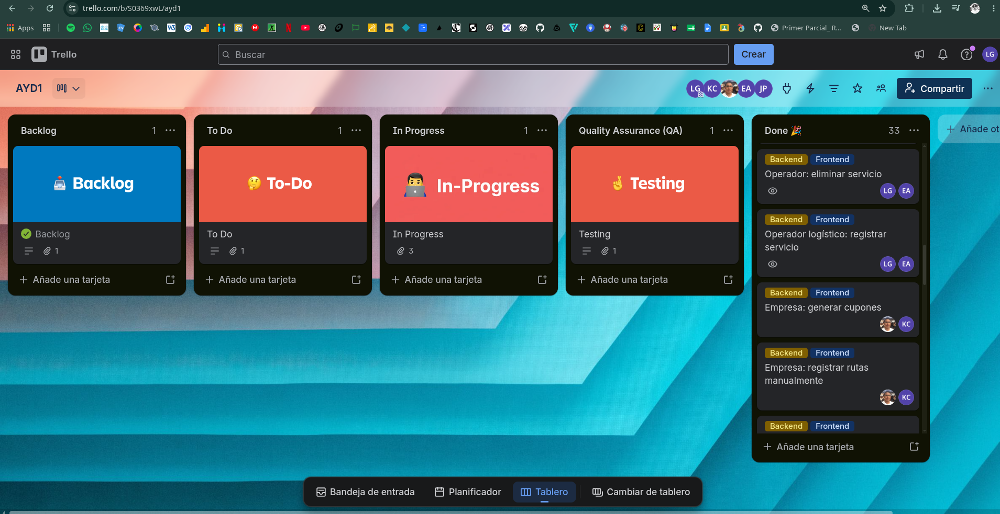
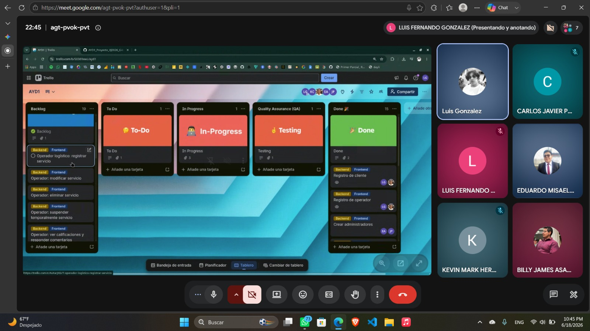
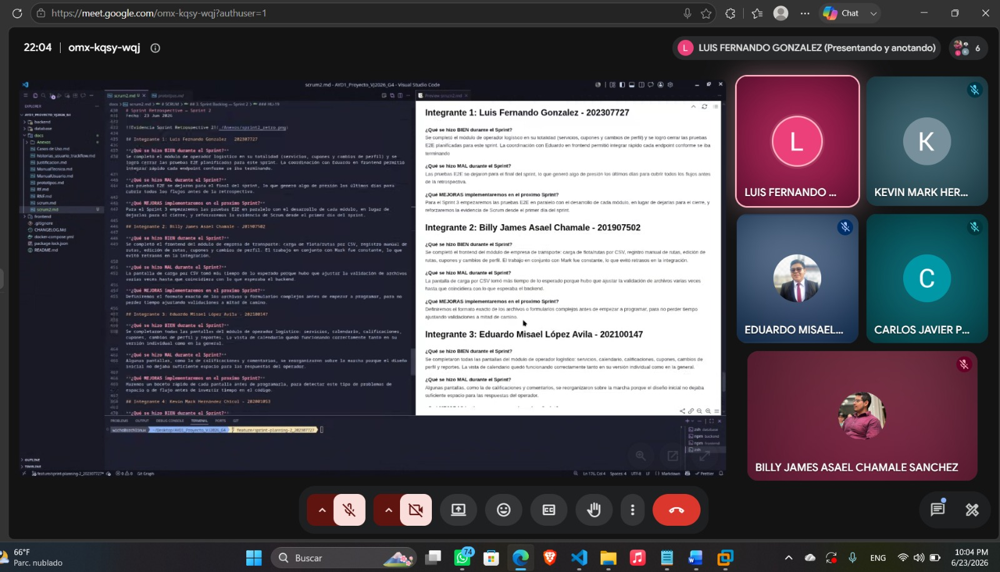

# **SCRUM**
## **1. Creacion de Product Backlog:**

[Tablero](https://trello.com/invite/b/6a2cd807bfdeb612aeb5c9a7/ATTI652b2e578fae0edca261724193a917beB5291EB6/ayd1)

## **2. Sprint Planning — Sprint 2**

#### **Datos de la Reunión:**

- Fecha: 18/06/2026
- Duracion: 2 Horas
- Plataforma: Google Meet
- Fin Sprint: 23/06/2026

---

#### **Roles Presentes:**
- **Scrum Master:** Luis Fernando Gonzalez - 202307727
- **Product Owner:** Kevin Mark Hernández Chicol - 202001053
- **Dev Team:**
    - Carlos Javier Pérez Pocón - 202206425
    - Eduardo Misael López Avila - 202100147
    - Billy James Asael Chamale Sanchez - 201907502

---

## **3. Sprint Backlog — Sprint 2**

### Técnica de estimación: Planning Poker (escala de Fibonacci)

Para estimar el esfuerzo de cada historia se usó Planning Poker: cada integrante estima de forma independiente con la secuencia de Fibonacci (1, 2, 3, 5, 8, 13...), se revelan las cartas al mismo tiempo y, si hay diferencias grandes, se discute brevemente hasta llegar a consenso. Esto evita que todos copien la primera cifra que alguien menciona.

Como referencia de calibración se usaron las historias del Sprint 1 (HU-02 y HU-04, de 3 y 5 puntos) para comparar la complejidad relativa de las nuevas historias.

---

### Resumen del Sprint Backlog

| HU | Historia (resumen) | Story Points | Prioridad | Asignado | Estado |
|----|---------------------|:---:|:---:|---|:---:|
| HU-11 | Operador: registrar / modificar / eliminar servicio | 8 | Alta | Luis + Eduardo | Completado |
| HU-12 | Operador: suspender temporalmente servicio | 3 | Media | Javier + Eduardo | Completado |
| HU-13 | Operador: ver calificaciones y responder comentarios | 5 | Media | Javier + Eduardo | Completado |
| HU-14 | Operador: vista tipo calendario de envíos | 5 | Alta | Javier + Eduardo | Completado |
| HU-15 | Operador: generar cupones | 3 | Media | Luis + Eduardo | Completado |
| HU-16 | Operador: solicitar cambios de perfil | 3 | Media | Luis + Eduardo | Completado |
| HU-17 | Empresa: cargar flota/rutas por CSV y manual | 8 | Alta | Mark + Billy | Completado |
| HU-18 | Empresa: editar / cancelar / suspender rutas | 5 | Alta | Mark + Billy | Completado |
| HU-19 | Empresa: generar cupones | 3 | Media | Mark + Billy | Completado |
| HU-20 | Empresa: solicitar cambios de perfil | 3 | Media | Mark + Billy | Completado |
| HU-21 | Reportes del operador (ganancias, clientes, calificaciones) | 5 | Media | Javier + Eduardo | Completado |
| HU-22 | Reportes de la empresa (ganancias, servicios, calificaciones, rutas) | 5 | Media | Javier + Eduardo | Completado |
| TT-01 | Pruebas unitarias (mín. 10, 2 por dev backend) | 5 | Alta | Luis + Javier + Mark | Completado |
| TT-02 | Pruebas E2E (mín. 5 de las 10 totales) | 5 | Alta | Luis | Completado |
| TT-03 | Evidencia Scrum Sprint 2 (Planning, Dailies, Retro) | 2 | Alta | Luis | Completado |

**Total comprometido:** 68 pts · **Completado al cierre del Sprint:** 68 pts

---

### Detalle de Historias de Usuario

### HU-11
**Como** operador logístico, **quiero** registrar, modificar y eliminar los servicios de envío que ofrezco, **para** mantener actualizada mi oferta dentro de la plataforma.

**Criterios de aceptación:**
- El formulario de registro solicita zona de cobertura, capacidad de carga (kg), precio por envío y un mínimo de 3 fotografías del vehículo/bodega.
- El operador puede editar cualquiera de estos datos una vez creado el servicio.
- El operador puede eliminar un servicio que ya no desea ofrecer.

**Story Points:** 8
**Prioridad:** Alta

---

### HU-12
**Como** operador logístico, **quiero** suspender temporalmente uno de mis servicios, **para** ocultarlo de la vista de los clientes sin eliminarlo del sistema.

**Criterios de aceptación:**
- Existe la opción "suspender temporalmente" en cada servicio.
- Un servicio suspendido no aparece en las búsquedas de los clientes.
- El servicio puede reactivarse en cualquier momento sin volver a registrarlo.

**Story Points:** 3
**Prioridad:** Media

---

### HU-13
**Como** operador logístico, **quiero** ver las calificaciones y comentarios de mis clientes y poder responderles, **para** mejorar mi reputación y atención al cliente.

**Criterios de aceptación:**
- El operador puede visualizar la calificación y el comentario de cada servicio.
- El operador puede escribir una respuesta pública a cada comentario.

**Story Points:** 5
**Prioridad:** Media

---

### HU-14
**Como** operador logístico, **quiero** visualizar en una vista tipo calendario las fechas en que los clientes han programado envíos, **para** organizar mi operación diaria.

**Criterios de aceptación:**
- El calendario muestra los envíos programados por servicio individual.
- Existe una vista general que combina todos los servicios del operador.

**Story Points:** 5
**Prioridad:** Alta

---

### HU-15
**Como** operador logístico, **quiero** generar cupones o códigos de descuento para mis clientes, **para** incentivar el uso de mis servicios en fechas especiales.

**Criterios de aceptación:**
- El operador puede crear un cupón con condiciones de descuento.
- El cupón queda disponible para los clientes seleccionados.

**Story Points:** 3
**Prioridad:** Media

---

### HU-16
**Como** operador logístico, **quiero** solicitar cambios en mi información de perfil, **para** mantenerla actualizada, sabiendo que requieren aprobación del administrador.

**Criterios de aceptación:**
- El operador puede editar los campos de su perfil y enviarlos a revisión.
- El cambio no se hace efectivo hasta que el administrador lo aprueba.
- El operador recibe una notificación con la resolución.

**Story Points:** 3
**Prioridad:** Media

---

### HU-17
**Como** empresa de transporte, **quiero** cargar mi flota y rutas mediante un archivo CSV o registrarlas manualmente, **para** ofrecer mis servicios de transporte en la plataforma.

**Criterios de aceptación:**
- La empresa puede subir un archivo CSV con los datos de flota y rutas.
- La empresa puede registrar una ruta individual mediante un formulario.
- El sistema valida el formato del archivo CSV antes de procesarlo.

**Story Points:** 8
**Prioridad:** Alta

---

### HU-18
**Como** empresa de transporte, **quiero** editar mis rutas y poder cancelarlas o suspenderlas ante emergencias, **para** mantener actualizada mi oferta y proteger a los clientes afectados.

**Criterios de aceptación:**
- Los cambios en una ruta se reflejan de inmediato en la vista del cliente.
- Al cancelar o suspender una ruta, los clientes afectados reciben una notificación por correo electrónico.

**Story Points:** 5
**Prioridad:** Alta

---

### HU-19
**Como** empresa de transporte, **quiero** generar cupones de descuento por temporada, **para** promover mis servicios entre los clientes.

**Criterios de aceptación:**
- La empresa puede crear cupones con condiciones definidas.
- Los cupones se envían al correo de los clientes seleccionados.

**Story Points:** 3
**Prioridad:** Media

---

### HU-20
**Como** empresa de transporte, **quiero** solicitar cambios en mi información de perfil, **para** mantenerla actualizada, sujeta a aprobación del administrador.

**Criterios de aceptación:**
- La empresa puede editar los campos de su perfil y enviarlos a revisión.
- El cambio no se hace efectivo hasta que el administrador lo aprueba.

**Story Points:** 3
**Prioridad:** Media

---

### HU-21
**Como** operador logístico, **quiero** generar y descargar reportes de mis ganancias, historial de clientes y calificaciones recibidas, **para** evaluar el desempeño de mi negocio en la plataforma.

**Criterios de aceptación:**
- Existe un reporte en PDF de ganancias por servicio y en general.
- Existe un historial de clientes que han usado los servicios del operador.
- Existe un reporte de calificaciones y comentarios recibidos.

**Story Points:** 5
**Prioridad:** Media

---

### HU-22
**Como** empresa de transporte, **quiero** generar y descargar reportes de ganancias, servicios contratados, calificaciones y estado de rutas, **para** evaluar el desempeño de mi operación.

**Criterios de aceptación:**
- Existe un reporte en PDF de ganancias generadas por los servicios.
- Existe un historial de servicios contratados.
- Existe un reporte de calificaciones y reseñas recibidas.
- Existe un reporte del estado de las rutas.

**Story Points:** 5
**Prioridad:** Media

---

### Tareas Técnicas

**TT-01 — Pruebas unitarias**
Se implementaron 10 pruebas unitarias, con al menos 2 por integrante del equipo de backend (Luis, Javier, Mark), cubriendo los componentes desarrollados en este sprint.
**Story Points:** 5 — **Prioridad:** Alta

**TT-02 — Pruebas E2E**
Se implementaron 5 pruebas E2E (de las 10 totales que exige el proyecto) sobre los flujos críticos de operador logístico y empresa de transporte.
**Story Points:** 5 — **Prioridad:** Alta

**TT-03 — Evidencia Scrum Sprint 2**
Se documentaron las capturas de Sprint Planning 2 y Sprint Retrospective 2 (fecha, hora, todos los integrantes presentes) y las Daily Scrum 4-6 con nombre, carnet, fecha y respuestas de cada integrante.
**Story Points:** 2 — **Prioridad:** Alta

---

#### **Decisiones técnicas**
- Se mantienen las decisiones del Sprint 1: Frontend Vue, Backend Express, Base de datos SQL Server, encriptación con `crypt`, tablero Kanban en Trello.
- Para el parseo de CSV de flota/rutas y para las pruebas E2E, el equipo definió la librería y herramienta final durante el desarrollo del sprint.

---

#### **Sprint Goal**
Al finalizar el Sprint 2, TrackFlow-HUB debe tener completos los módulos de operador logístico (gestión de servicios, calificaciones, calendario, cupones, edición de perfil, reportes) y de empresa de transporte (gestión de rutas/flota, cupones, edición de perfil, reportes), además de un mínimo de 10 pruebas unitarias y 5 pruebas E2E funcionando correctamente, con la evidencia documental completa de Sprint Planning, Daily Scrum y Sprint Retrospective del Sprint 2.

---

## **4. Daily Scrum**

# Daily Scrum — Sprint 2 — Día 1
Fecha: 20 Jun 2026

## Integrante 1: Luis Fernando Gonzalez - 202307727

**¿Qué hice ayer?**
Inicié el desarrollo del backend para el registro de servicios del operador logístico, definiendo el modelo de datos para zona de cobertura, capacidad de carga, precio y fotografías.

**¿Qué haré hoy?**
Continuaré con los endpoints para modificar y eliminar servicios del operador.

**¿Impedimentos?**
Ninguno por el momento.

## Integrante 2: Billy James Asael Chamale Sanchez - 201907502

**¿Qué hice ayer?**
Organicé las carpetas y vistas .vue del módulo de empresa de transporte.

**¿Qué haré hoy?**
Implementaré la pantalla para que la empresa cargue su flota y rutas mediante un archivo CSV.

**¿Impedimentos?**
Ninguno por el momento.

## Integrante 3: Eduardo Misael López Avila - 202100147

**¿Qué hice ayer?**
Organicé las vistas .vue del módulo de operador logístico (servicios, calendario, cupones).

**¿Qué haré hoy?**
Implementaré el formulario de registro de servicio, conectándolo con el backend que está desarrollando Luis.

**¿Impedimentos?**
Ninguno por el momento.

## Integrante 4: Kevin Mark Hernández Chicol - 202001053

**¿Qué hice ayer?**
Diseñé el modelo de datos para flota y rutas de las empresas de transporte y definí la estructura del archivo CSV que se va a importar.

**¿Qué haré hoy?**
Empezaré el endpoint para la carga de flota y rutas vía CSV, incluyendo la validación del formato del archivo.

**¿Impedimentos?**
Ninguno por el momento.

## Integrante 5: Carlos Javier Pérez Pocón - 202206425

**¿Qué hice ayer?**
Revisé los requerimientos de calificaciones, comentarios y vista de calendario del operador para planificar el backend de ambas funcionalidades.

**¿Qué haré hoy?**
Implementaré el endpoint para que el operador suspenda temporalmente uno de sus servicios.

**¿Impedimentos?**
Ninguno por el momento.

---

# Daily Scrum — Sprint 2 — Día 2
Fecha: 21 Jun 2026

## Integrante 1: Luis Fernando Gonzalez - 202307727

**¿Qué hice ayer?**
Terminé los endpoints para modificar y eliminar servicios del operador logístico.

**¿Qué haré hoy?**
Implementaré el endpoint para que el operador genere cupones de descuento para sus clientes.

**¿Impedimentos?**
Ninguno por el momento.

## Integrante 2: Billy James Asael Chamale Sanchez - 201907502

**¿Qué hice ayer?**
Terminé la pantalla de carga de flota/rutas por CSV y probé la subida de archivos con datos de ejemplo.

**¿Qué haré hoy?**
Implementaré el formulario para que la empresa registre rutas de forma manual.

**¿Impedimentos?**
Ninguno por el momento.

## Integrante 3: Eduardo Misael López Avila - 202100147

**¿Qué hice ayer?**
Terminé el formulario de registro de servicio y comencé las pantallas de modificar y eliminar servicios.

**¿Qué haré hoy?**
Implementaré la vista tipo calendario de los envíos programados por el operador.

**¿Impedimentos?**
Ninguno por el momento.

## Integrante 4: Kevin Mark Hernández Chicol - 202001053

**¿Qué hice ayer?**
Implementé el endpoint de carga de flota/rutas por CSV y validé el formato del archivo.

**¿Qué haré hoy?**
Implementaré el registro manual de rutas y el endpoint para editar rutas existentes.

**¿Impedimentos?**
Ninguno por el momento.

## Integrante 5: Carlos Javier Pérez Pocón - 202206425

**¿Qué hice ayer?**
Terminé el endpoint para suspender temporalmente un servicio del operador.

**¿Qué haré hoy?**
Implementaré el endpoint para que el operador vea y responda las calificaciones y comentarios de sus clientes.

**¿Impedimentos?**
Ninguno por el momento.

---

# Daily Scrum — Sprint 2 — Día 3
Fecha: 22 Jun 2026

## Integrante 1: Luis Fernando Gonzalez - 202307727

**¿Qué hice ayer?**
Terminé el endpoint de cupones y comencé el de solicitud de cambios de perfil del operador.

**¿Qué haré hoy?**
Terminaré el endpoint de cambios de perfil del operador y comenzaré las pruebas E2E del módulo.

**¿Impedimentos?**
Ninguno por el momento.

## Integrante 2: Billy James Asael Chamale Sanchez - 201907502

**¿Qué hice ayer?**
Terminé el formulario de registro manual de rutas y la pantalla para editar rutas existentes.

**¿Qué haré hoy?**
Implementaré las pantallas de cupones y de cambios de perfil para la empresa de transporte.

**¿Impedimentos?**
Ninguno por el momento.

## Integrante 3: Eduardo Misael López Avila - 202100147

**¿Qué hice ayer?**
Terminé la vista de calendario y comencé la pantalla de calificaciones y comentarios del operador.

**¿Qué haré hoy?**
Terminaré las pantallas de cupones y cambios de perfil del operador, e integraré la vista de reportes del operador.

**¿Impedimentos?**
Ninguno por el momento.

## Integrante 4: Kevin Mark Hernández Chicol - 202001053

**¿Qué hice ayer?**
Terminé la edición de rutas y el endpoint para cancelar o suspender rutas con notificación a los clientes afectados.

**¿Qué haré hoy?**
Implementaré el endpoint de cupones y de cambios de perfil para empresas de transporte, y apoyaré con las pruebas unitarias del backend.

**¿Impedimentos?**
Ninguno por el momento.

## Integrante 5: Carlos Javier Pérez Pocón - 202206425

**¿Qué hice ayer?**
Terminé la gestión de calificaciones/comentarios y la vista de calendario en el backend del operador.

**¿Qué haré hoy?**
Implementaré los reportes en PDF del operador y de la empresa de transporte, y completaré las pruebas unitarias del módulo.

**¿Impedimentos?**
Ninguno por el momento.

---

## **5. Sprint Retrospective**

# Sprint Retrospective — Sprint 2
Fecha: 23 Jun 2026

## Integrante 1: Luis Fernando Gonzalez - 202307727

**¿Qué se hizo BIEN durante el Sprint?**
Se completó el módulo de operador logístico en su totalidad (servicios, cupones y cambios de perfil) y se logró cerrar las pruebas E2E planificadas para este sprint. La coordinación con Eduardo en frontend permitió integrar rápido cada endpoint conforme se iba terminando.

**¿Qué se hizo MAL durante el Sprint?**
Las pruebas E2E se dejaron para el final del sprint, lo que generó algo de presión los últimos días para cubrir todos los flujos antes de la retrospectiva.

**¿Qué MEJORAS implementaremos en el proximo Sprint?**
Para el Sprint 3 empezaremos las pruebas E2E en paralelo con el desarrollo de cada módulo, en lugar de dejarlas para el cierre, y reforzaremos la evidencia de Scrum desde el primer día del sprint.

## Integrante 2: Billy James Asael Chamale - 201907502

**¿Qué se hizo BIEN durante el Sprint?**
Se completó el frontend del módulo de empresa de transporte: carga de flota/rutas por CSV, registro manual de rutas, edición de rutas, cupones y cambios de perfil. El trabajo en conjunto con Mark fue constante, lo que evitó retrasos en la integración.

**¿Qué se hizo MAL durante el Sprint?**
La pantalla de carga por CSV tomó más tiempo de lo esperado porque hubo que ajustar la validación de archivos varias veces hasta que coincidiera con lo que esperaba el backend.

**¿Qué MEJORAS implementaremos en el proximo Sprint?**
Definiremos el formato exacto de los archivos o formularios complejos antes de empezar a programar, para no perder tiempo ajustando validaciones a mitad de camino.

## Integrante 3: Eduardo Misael López Avila - 202100147

**¿Qué se hizo BIEN durante el Sprint?**
Se completaron todas las pantallas del módulo de operador logístico: servicios, calendario, calificaciones, cupones, cambios de perfil y reportes. La vista de calendario quedó funcionando correctamente tanto en su versión individual como en la general.

**¿Qué se hizo MAL durante el Sprint?**
Algunas pantallas, como la de calificaciones y comentarios, se reorganizaron sobre la marcha porque el diseño inicial no dejaba suficiente espacio para las respuestas del operador.

**¿Qué MEJORAS implementaremos en el proximo Sprint?**
Haremos un boceto rápido de cada pantalla antes de programarla, para detectar este tipo de problemas de espacio o de flujo antes de invertir tiempo en el código.

## Integrante 4: Kevin Mark Hernández Chicol - 202001053

**¿Qué se hizo BIEN durante el Sprint?**
Se completó el módulo de empresa de transporte: carga de flota/rutas por CSV, registro manual, edición y cancelación/suspensión de rutas con notificación a los clientes, cupones y cambios de perfil. También se apoyó en las pruebas unitarias del equipo de backend.

**¿Qué se hizo MAL durante el Sprint?**
La validación del archivo CSV requirió varias iteraciones antes de quedar estable, lo que retrasó un poco el inicio del registro manual de rutas.

**¿Qué MEJORAS implementaremos en el proximo Sprint?**
Para el Sprint 3 dejaremos definida la estructura de los archivos o datos de entrada desde la planificación, antes de empezar a programar la validación.

## Integrante 5: Carlos Javier Pérez Pocón - 202206425

**¿Qué se hizo BIEN durante el Sprint?**
Se completó la suspensión temporal de servicios, la gestión de calificaciones y comentarios, la vista de calendario en backend, y los reportes en PDF tanto del operador como de la empresa de transporte. También se cumplió con las pruebas unitarias asignadas al equipo de backend.

**¿Qué se hizo MAL durante el Sprint?**
Los reportes en PDF se dejaron para los últimos días del sprint, lo que dejó poco margen para revisarlos con calma antes del cierre.

**¿Qué MEJORAS implementaremos en el proximo Sprint?**
Distribuiremos mejor el orden de las tareas para que los reportes y las pruebas no queden todas agrupadas al final del sprint, sino repartidas durante toda la semana.