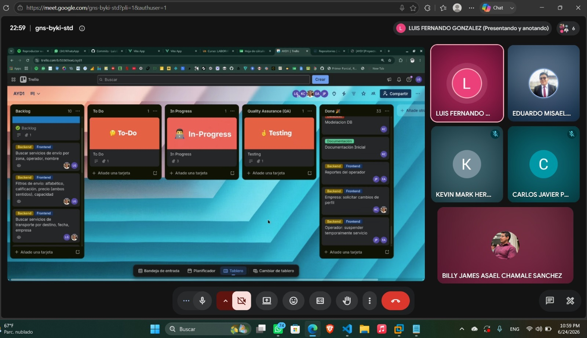
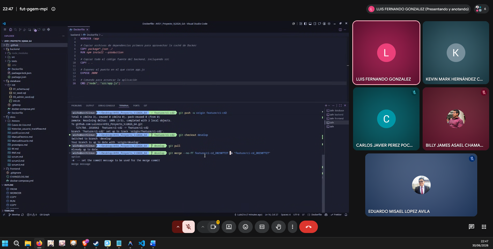

# **SCRUM**
## **1. Creacion de Product Backlog:**

[Tablero](https://trello.com/invite/b/6a2cd807bfdeb612aeb5c9a7/ATTI652b2e578fae0edca261724193a917beB5291EB6/ayd1)

## **2. Sprint Planning — Sprint 3**

#### **Datos de la Reunión:**

- Fecha: 24/06/2026
- Duracion: 2 Horas
- Plataforma: Google Meet
- Fin Sprint: 30/06/2026

---

#### **Roles Presentes:**
- **Scrum Master:** Luis Fernando Gonzalez - 202307727
- **Product Owner:** Kevin Mark Hernández Chicol - 202001053
- **Dev Team:**
    - Carlos Javier Pérez Pocón - 202206425
    - Eduardo Misael López Avila - 202100147
    - Billy James Asael Chamale Sanchez - 201907502

---

## **3. Sprint Backlog — Sprint 3**

### Técnica de estimación: Planning Poker (escala de Fibonacci)

Para este último sprint, se evaluaron todos los requerimientos pendientes de la rúbrica final. Usando como referencia las historias del Sprint 2, el equipo estimó el esfuerzo para completar el módulo de clientes (búsqueda, pagos, carrito, calificaciones y reportes), los módulos de administrador (visualización de información y reportes estadísticos), y la capa de pruebas y despliegue CI/CD que cierra el proyecto.

---

### Resumen del Sprint Backlog

| HU / TT | Historia / Requisito (resumen) | Story Points | Prioridad | Asignado | Estado |
|----|---------------------|:---:|:---:|---|:---:|
| HU-23 | Cliente: buscar servicios de envío por zona, operador y nombre, con filtros (alfabético, calificación, precio, capacidad) | 5 | Alta | Luis + Billy | Completado |
| HU-24 | Cliente: buscar servicios de transporte por destino, fecha y empresa, con filtros (hora, tiempo, precio, calificación) | 5 | Alta | Mark + Billy | Completado |
| HU-25 | Cliente: programar envío con mínimo 24 h de anticipación y sin traslape; sugerencias cruzadas (envío → 3 mejores transportes y viceversa) | 8 | Alta | Mark + Billy | Completado |
| HU-26 | Cliente: gestión de pagos con tarjeta simulada (saldo Q1,000, validación Luhn manual) y segundo método de pago simulado | 8 | Alta | Mark + Billy | Completado |
| HU-27 | Cliente: carrito de compras persistente (se mantiene al cerrar sesión) y cancelación de reservación hasta 24 h antes | 5 | Alta | Luis + Billy | Completado |
| HU-28 | Cliente: calificar y comentar servicios de envío (al finalizar fecha) y de transporte (al finalizar trayecto) | 5 | Alta | Luis + Billy | Completado |
| HU-29 | Cliente: reportar problemas con evidencias e historial de reportes con estados | 5 | Alta | Luis + Billy | Completado |
| HU-30 | Admin: gestión de reportes de plataforma (ver todos, cambiar estado) y gestión de cambios en perfiles (revisar, aceptar/rechazar, notificar) | 5 | Alta | Javier + Luis + Eduardo | Completado |
| HU-31 | Admin: visualización de información (servicios por zona/empresa, envíos por destino/operador) y reportes estadísticos completos | 8 | Alta | Luis + Mark + Eduardo | Completado |
| HU-32 | Operador: ver y responder calificaciones/comentarios de clientes, calendario de envíos programados y reportes PDF | 5 | Media | Javier + Eduardo | Completado |
| HU-33 | Empresa: cancelar/suspender rutas con notificación a clientes por correo y reportes PDF | 5 | Media | Mark + Javier + Billy | Completado |
| TT-04 | Implementación final de arquitectura CI/CD y despliegue del backend en la nube (Docker) | 5 | Alta | Todo el equipo | Completado |
| TT-05 | Evidencia Scrum Sprint 3 (Planning, Dailies, Retro) y documentación final | 2 | Alta | Luis | Completado |

**Total comprometido:** 71 pts · **Completado al cierre del Sprint:** 71 pts

---

### Detalle de Historias de Usuario

### HU-23
**Como** cliente, **quiero** buscar servicios de envío por zona de cobertura, operador logístico y nombre del servicio con filtros avanzados, **para** encontrar rápidamente la opción que mejor se adapte a mis necesidades.

**Criterios de aceptación:**
- El buscador permite filtrar por zona, operador y nombre del servicio.
- Los resultados pueden ordenarse alfabéticamente, por mejor calificación, por precio (ambas direcciones) y por capacidad de carga.
- Al hacer clic en un resultado se accede a los detalles completos del servicio.

**Story Points:** 5
**Prioridad:** Alta

---

### HU-24
**Como** cliente, **quiero** buscar servicios de transporte por destino, fecha, empresa y tipo de servicio, **para** planificar mis traslados con la empresa adecuada.

**Criterios de aceptación:**
- El buscador permite filtrar por destino, fecha, empresa y tipo de servicio.
- Los resultados pueden ordenarse por hora de inicio, tiempo estimado de entrega, precio y calificación de la empresa (ambas direcciones).

**Story Points:** 5
**Prioridad:** Alta

---

### HU-25
**Como** cliente, **quiero** programar un envío con al menos 24 horas de anticipación y sin traslape con otras reservaciones, y recibir sugerencias cruzadas de servicios complementarios, **para** coordinar mis logísticas eficientemente.

**Criterios de aceptación:**
- El sistema rechaza programaciones con menos de 24 horas de anticipación.
- El sistema valida que no existan traslapes con otras reservaciones del cliente.
- Al elegir un servicio de envío, se sugieren los 3 operadores de transporte mejor calificados para la zona, con opción de ver todos.
- Al elegir un servicio de transporte, se sugieren los 3 operadores de envío mejor calificados del destino, con opción de ver todos.

**Story Points:** 8
**Prioridad:** Alta

---

### HU-26
**Como** cliente, **quiero** pagar mis servicios mediante tarjeta de crédito/débito simulada o un segundo método de pago alternativo, **para** confirmar mis reservaciones de forma segura.

**Criterios de aceptación:**
- Al registrar una tarjeta ficticia se asigna un saldo inicial de Q1,000; las compras se descuentan de ese saldo.
- Los campos de tarjeta incluyen número, nombre, fecha de vencimiento y CVV.
- El número de tarjeta es validado mediante el algoritmo de Luhn implementado manualmente.
- Existe un segundo método de pago simulado (tipo wallet o transferencia).
- La reservación solo se confirma cuando el pago ha sido procesado exitosamente.

**Story Points:** 8
**Prioridad:** Alta

---

### HU-27
**Como** cliente, **quiero** tener un carrito de compras persistente y poder cancelar reservaciones hasta 24 horas antes, **para** gestionar mis servicios con flexibilidad.

**Criterios de aceptación:**
- Los servicios agregados al carrito se mantienen aunque el cliente cierre sesión.
- El cliente puede cancelar una reservación hasta 24 horas antes de la fecha programada.
- Se aplica algún mecanismo de reembolso al cancelar.

**Story Points:** 5
**Prioridad:** Alta

---

### HU-28
**Como** cliente, **quiero** calificar y comentar los servicios que he utilizado, **para** compartir mi experiencia con otros usuarios de la plataforma.

**Criterios de aceptación:**
- La opción de calificar servicios de envío se habilita una vez concluida la fecha de entrega programada.
- La opción de calificar servicios de transporte se habilita una vez finalizado el trayecto contratado.
- El cliente puede dejar un comentario y una puntuación numérica en ambos casos.

**Story Points:** 5
**Prioridad:** Alta

---

### HU-29
**Como** cliente, **quiero** reportar problemas relacionados con mis servicios contratados y adjuntar evidencias, **para** que el administrador tome las acciones correspondientes.

**Criterios de aceptación:**
- El cliente puede reportar problemas de envío (recolección no realizada, cobro no acordado, daño al paquete) y de transporte (retrasos, cobros extra, cancelaciones sin aviso).
- El cliente puede adjuntar evidencias al reporte.
- El cliente puede ver el historial de sus reportes con los estados: Enviado, En estudio, Aceptado y Rechazado.

**Story Points:** 5
**Prioridad:** Alta

---

### HU-30
**Como** administrador, **quiero** gestionar los reportes generados en la plataforma y los cambios de perfil solicitados por operadores y empresas, **para** mantener el control y la integridad del sistema.

**Criterios de aceptación:**
- El administrador puede ver todos los reportes de la plataforma y cambiar su estado (Enviado, En revisión, Aceptado, Rechazado).
- El administrador puede revisar, aceptar o rechazar solicitudes de cambio de perfil de operadores y empresas, notificando al usuario la resolución.

**Story Points:** 5
**Prioridad:** Alta

---

### HU-31
**Como** administrador, **quiero** observar información detallada de los servicios registrados y acceder a reportes estadísticos completos de la plataforma, **para** tomar decisiones informadas sobre la operación.

**Criterios de aceptación:**
- Se pueden visualizar los servicios de transporte ordenados por zona y empresa, y los envíos por destino y operador.
- Los siguientes reportes están disponibles con descarga en PDF:
  - Logs de registros y vetos de usuarios.
  - Gráfica de usuarios aceptados/rechazados por tipo.
  - Gráfica de zonas con mayor volumen de envíos.
  - Gráfica de servicios de transporte más utilizados.
  - Gráfica de ingresos generados por tipo de servicio.
  - Resumen de reportes emitidos y su estado.
  - Historial de usuarios con mayor gasto.
  - Historial de envíos realizados.
  - Historial de servicios de transporte.
  - Gráfica de destinos más frecuentes.
  - Gráfica de uso de clientes (solo envíos, solo transporte, ambos).

**Story Points:** 8
**Prioridad:** Alta

---

### HU-32
**Como** operador logístico, **quiero** ver y responder las calificaciones de mis clientes, consultar mi calendario de envíos y descargar reportes en PDF, **para** gestionar mi operación con visibilidad completa.

**Criterios de aceptación:**
- El operador puede ver las calificaciones y comentarios recibidos y responder a cada uno.
- El operador puede visualizar en un calendario los envíos programados (individual por servicio y vista general).
- Están disponibles los reportes en PDF: ganancias por servicio y en general, historial de clientes e historial de calificaciones y comentarios.

**Story Points:** 5
**Prioridad:** Media

---

### HU-33
**Como** empresa de transporte, **quiero** cancelar o suspender rutas notificando automáticamente a los clientes afectados, y acceder a reportes en PDF de mi operación, **para** gestionar incidencias y evaluar mi desempeño.

**Criterios de aceptación:**
- Al cancelar o suspender una ruta, los clientes afectados reciben una notificación por correo electrónico inmediatamente.
- Están disponibles los reportes en PDF: ganancias generadas, historial de servicios contratados, calificaciones/reseñas recibidas y estado de las rutas.

**Story Points:** 5
**Prioridad:** Media

---

### Tareas Técnicas

**TT-04 — CI/CD y despliegue final**
Se configuró e implementó la arquitectura de Integración Continua/Despliegue Continuo (CI/CD) del proyecto. El backend fue desplegado en un servicio en la nube utilizando contenedores Docker, validando que el pipeline de despliegue automático funcionara correctamente de extremo a extremo. Las pruebas unitarias (10 en total) y E2E (5 en total) requeridas quedaron completadas en el Sprint 2 y se verificó que seguían pasando correctamente sobre el entorno desplegado.
**Story Points:** 5 — **Prioridad:** Alta

**TT-05 — Evidencia Scrum Sprint 3**
Se documentaron las capturas del Sprint Planning 3 y del Sprint Retrospective 3 (fecha, hora, todos los integrantes presentes) y los Daily Scrum 7, 8 y 9 con nombre, carnet, fecha y respuestas de cada integrante.
**Story Points:** 2 — **Prioridad:** Alta

---

#### **Decisiones técnicas**
- Se mantienen las decisiones de los sprints anteriores: Frontend Vue, Backend Express, Base de datos SQL Server, encriptación con `crypt`, tablero Kanban en Trello.
- El algoritmo de Luhn se implementó de forma manual en el backend, sin librerías externas.
- Las notificaciones por correo (veto, cancelación de rutas, cambios de perfil) se enviaron con la misma librería de correo utilizada desde el Sprint 1.

---

#### **Sprint Goal**
Al finalizar el Sprint 3, TrackFlow-HUB debe tener completamente funcional el módulo de clientes (búsqueda, filtros, carrito persistente, pagos con Luhn, sugerencias cruzadas, calificaciones y reportes), los módulos de administrador (visualización de información y todos los reportes estadísticos), los reportes PDF del operador y la empresa, la capa completa de pruebas unitarias y E2E según la rúbrica, y la documentación Scrum del sprint cerrada.

---

## **4. Daily Scrum**

# Daily Scrum — Sprint 3 — Día 1
Fecha: 25 Jun 2026

## Integrante 1: Luis Fernando Gonzalez - 202307727

**¿Qué hice ayer?**
Revisé los endpoints ya existentes del Sprint 2 para identificar qué tablas y relaciones necesitaría para construir la búsqueda y los filtros de servicios de envío del módulo de clientes.

**¿Qué haré hoy?**
Implementaré el endpoint de búsqueda de servicios de envío, permitiendo filtrar por zona de cobertura, operador y nombre del servicio, y añadiré el soporte para los parámetros de ordenamiento (alfabético, calificación, precio y capacidad).

**¿Impedimentos?**
Ninguno por el momento.

## Integrante 2: Billy James Asael Chamale Sanchez - 201907502

**¿Qué hice ayer?**
Organicé las carpetas y vistas `.vue` del módulo de clientes, definiendo la estructura de componentes para la búsqueda de envíos, la búsqueda de transporte, el carrito y las pantallas de pago.

**¿Qué haré hoy?**
Comenzaré a implementar la vista de búsqueda de servicios de envío, conectándola con el endpoint que está desarrollando Luis, e incluiré los controles de filtrado en el frontend.

**¿Impedimentos?**
Ninguno por el momento.

## Integrante 3: Eduardo Misael López Avila - 202100147

**¿Qué hice ayer?**
Analicé los reportes estadísticos que debe mostrar el panel de administrador y definí la estructura visual de los gráficos (barras, pastel, tablas) para cada uno de los once reportes requeridos.

**¿Qué haré hoy?**
Implementaré las vistas del módulo de reportes del administrador, comenzando por la pantalla de logs de registros y vetos y la gráfica de usuarios aceptados/rechazados.

**¿Impedimentos?**
Ninguno por el momento.

## Integrante 4: Kevin Mark Hernández Chicol - 202001053

**¿Qué hice ayer?**
Revisé los requerimientos del módulo de clientes para planificar la búsqueda de transporte, la programación de envíos (sin traslape y con 24 h de anticipación) y el flujo de sugerencias cruzadas entre servicios.

**¿Qué haré hoy?**
Comenzaré el endpoint de búsqueda de servicios de transporte con filtros (destino, fecha, empresa, hora, precio y calificación), y avanzaré en la lógica de validación de traslapes para la programación de envíos.

**¿Impedimentos?**
Ninguno por el momento.

## Integrante 5: Carlos Javier Pérez Pocón - 202206425

**¿Qué hice ayer?**
Revisé las librerías de generación de PDF que se usaron en el Sprint 2 para los reportes del operador y la empresa, y analicé qué datos adicionales necesitaría exponer el backend para los reportes estadísticos del administrador.

**¿Qué haré hoy?**
Implementaré los endpoints de gestión de reportes del administrador (listar todos los reportes de la plataforma y actualizar su estado), y comenzaré los endpoints para gestionar las solicitudes de cambio de perfil de operadores y empresas.

**¿Impedimentos?**
Ninguno por el momento.

---

# Daily Scrum — Sprint 3 — Día 2
Fecha: 27 Jun 2026

## Integrante 1: Luis Fernando Gonzalez - 202307727

**¿Qué hice ayer?**
Terminé el endpoint de búsqueda de servicios de envío con todos sus parámetros de filtrado y ordenamiento. También inicié el endpoint para el carrito de compras persistente, diseñando la lógica de guardado en base de datos para que se mantenga al cerrar sesión.

**¿Qué haré hoy?**
Completaré el carrito persistente y avanzaré con el endpoint de cancelación de reservaciones, implementando la validación de las 24 horas de anticipación y el mecanismo de reembolso.

**¿Impedimentos?**
Ninguno por el momento.

## Integrante 2: Billy James Asael Chamale Sanchez - 201907502

**¿Qué hice ayer?**
Terminé la vista de búsqueda de servicios de envío con sus filtros y comencé la pantalla de búsqueda de transporte, integrando los controles de filtrado con el endpoint de Mark.

**¿Qué haré hoy?**
Implementaré la pantalla de programación de envíos, incluyendo la interfaz de selección de fechas con validación visual del traslape, y comenzaré la pantalla de sugerencias cruzadas.

**¿Impedimentos?**
Ninguno por el momento.

## Integrante 3: Eduardo Misael López Avila - 202100147

**¿Qué hice ayer?**
Terminé la vista de logs de registros y vetos y la gráfica de usuarios aceptados/rechazados. También implementé las gráficas de zonas con mayor volumen de envíos y servicios de transporte más utilizados, consumiendo los endpoints que fue construyendo el equipo de backend.

**¿Qué haré hoy?**
Implementaré las vistas de las gráficas de ingresos por tipo de servicio, destinos más frecuentes y uso de clientes, y avanzaré con la pantalla de gestión de cambios de perfil del administrador.

**¿Impedimentos?**
Ninguno por el momento.

## Integrante 4: Kevin Mark Hernández Chicol - 202001053

**¿Qué hice ayer?**
Terminé el endpoint de búsqueda de transporte con todos sus filtros y completé la validación de traslapes y el mínimo de 24 horas de anticipación para programar envíos. También inicié la lógica de sugerencias cruzadas.

**¿Qué haré hoy?**
Terminaré las sugerencias cruzadas y comenzaré la gestión de pagos: implementaré la lógica de tarjeta simulada con saldo Q1,000 y el algoritmo de Luhn de forma manual, sin librerías externas.

**¿Impedimentos?**
Ninguno por el momento.

## Integrante 5: Carlos Javier Pérez Pocón - 202206425

**¿Qué hice ayer?**
Terminé los endpoints de gestión de reportes del administrador (listar y cambiar estado) y los de gestión de solicitudes de cambio de perfil de operadores y empresas. También comencé la vista de calendario de envíos del operador en backend.

**¿Qué haré hoy?**
Completaré los endpoints para los reportes estadísticos del administrador (logs, gráficas de usuarios, zonas, ingresos, historial de envíos y transporte) y trabajaré en los reportes PDF del operador logístico.

**¿Impedimentos?**
Ninguno por el momento.

---

# Daily Scrum — Sprint 3 — Día 3
Fecha: 29 Jun 2026

## Integrante 1: Luis Fernando Gonzalez - 202307727

**¿Qué hice ayer?**
Terminé el carrito persistente y la cancelación de reservaciones con su mecanismo de reembolso. También completé los endpoints de calificaciones para servicios de envío (se habilita al concluir la fecha de entrega) y el endpoint para que los clientes reporten problemas con evidencias.

**¿Qué haré hoy?**
Haré las pruebas de integración de todos los endpoints del módulo de clientes que desarrollé, corregiré los errores encontrados y apoyaré con las pruebas E2E de los flujos de carrito y cancelación de reservaciones.

**¿Impedimentos?**
Ninguno por el momento.

## Integrante 2: Billy James Asael Chamale Sanchez - 201907502

**¿Qué hice ayer?**
Terminé las pantallas de sugerencias cruzadas y el flujo completo de pagos con tarjeta simulada y el segundo método de pago alternativo, integrándolas con los endpoints de Mark.

**¿Qué haré hoy?**
Implementaré las pantallas de calificaciones/comentarios y de reporte de problemas del cliente, incluyendo la subida de evidencias. También haré revisión final de consistencia visual en todas las vistas del módulo de clientes.

**¿Impedimentos?**
Ninguno por el momento.

## Integrante 3: Eduardo Misael López Avila - 202100147

**¿Qué hice ayer?**
Terminé todas las vistas de reportes estadísticos del administrador y la pantalla de gestión de cambios de perfil. También implementé la pantalla de historial de envíos realizados y el historial de servicios de transporte.

**¿Qué haré hoy?**
Haré una revisión integral de todas las vistas del administrador verificando la consistencia de diseño, mensajes de error y confirmaciones. También apoyaré a Javier con la integración de las vistas del operador (calificaciones y reportes PDF).

**¿Impedimentos?**
Ninguno por el momento.

## Integrante 4: Kevin Mark Hernández Chicol - 202001053

**¿Qué hice ayer?**
Terminé la gestión de pagos completa (tarjeta simulada con Luhn manual y segundo método de pago) y los endpoints de cancelación y suspensión de rutas de empresas de transporte con el envío automático de notificaciones por correo a los clientes afectados.

**¿Qué haré hoy?**
Realizaré pruebas unitarias sobre la validación de Luhn y los flujos de reservación para completar el mínimo requerido. También apoyaré con las pruebas E2E del flujo de pagos y programación de envíos.

**¿Impedimentos?**
Ninguno por el momento.

## Integrante 5: Carlos Javier Pérez Pocón - 202206425

**¿Qué hice ayer?**
Completé todos los endpoints de reportes estadísticos del administrador y terminé los reportes PDF del operador logístico (ganancias por servicio y en general, historial de clientes, y reporte de calificaciones/comentarios). También generé los reportes PDF de la empresa de transporte.

**¿Qué haré hoy?**
Realizaré las pruebas unitarias del módulo de administrador y apoyaré con las pruebas E2E del flujo de reportes. También haré revisión final de los reportes PDF para verificar que el formato y los datos sean correctos antes del cierre del sprint.

**¿Impedimentos?**
Ninguno por el momento.

---

## **5. Sprint Retrospective**

# Sprint Retrospective — Sprint 3
Fecha: 30 Jun 2026

## Integrante 1: Luis Fernando Gonzalez - 202307727

**¿Qué se hizo BIEN durante el Sprint?**
Se completó exitosamente todo el backend del módulo de clientes asignado: buscador de envíos con filtros, carrito persistente, cancelación de reservaciones con reembolso, calificaciones de servicios de envío y el sistema de reporte de problemas con evidencias. La coordinación con Billy para la integración frontend-backend fue fluida, lo que permitió avanzar sin bloqueos. También se logró mantener la calidad de los endpoints con validaciones correctas desde el esquema de base de datos.

**¿Qué se hizo MAL durante el Sprint?**
La lógica del carrito persistente requirió más iteraciones de las esperadas para manejar correctamente los casos en que el cliente cierra sesión con ítems en proceso de pago. Esto consumió tiempo adicional que pudo haberse distribuido en pruebas más tempranas.

**¿Qué MEJORAS implementaremos en el proximo Sprint?**
Para futuros proyectos, se abordará la lógica de persistencia de estado desde la fase de diseño de base de datos, antes de comenzar a programar, a fin de evitar ajustes a mitad del desarrollo. Asimismo, se integrarán las pruebas E2E desde el primer día del sprint, en lugar de concentrarlas al final.

## Integrante 2: Billy James Asael Chamale Sanchez - 201907502

**¿Qué se hizo BIEN durante el Sprint?**
Se completaron todas las vistas del módulo de clientes: buscador de envíos y transporte con filtros, programación de envíos con validación visual, sugerencias cruzadas, flujo completo de pagos (tarjeta simulada y segundo método), carrito persistente, calificaciones, y pantalla de reporte de problemas. La integración con los endpoints fue constante y no se presentaron bloqueos significativos. El flujo de pagos quedó intuitivo y funcional.

**¿Qué se hizo MAL durante el Sprint?**
La pantalla de sugerencias cruzadas requirió varios ajustes de diseño para presentar de forma clara tanto la sugerencia principal como la opción de ver todos, lo que tomó más tiempo del estimado inicialmente.

**¿Qué MEJORAS implementaremos en el proximo Sprint?**
Definiremos los flujos de pantallas más complejas (como sugerencias cruzadas o pagos) con un boceto detallado antes de codificar, para anticipar los casos borde de presentación y no perder tiempo en ajustes visuales a mitad de la implementación.

## Integrante 3: Eduardo Misael López Avila - 202100147

**¿Qué se hizo BIEN durante el Sprint?**
Se implementaron correctamente todas las vistas del módulo de reportes estadísticos del administrador: once reportes diferentes con sus respectivas gráficas y tablas, la pantalla de gestión de cambios de perfil y la pantalla de visualización de información de servicios. La estructura visual resultó consistente y alineada con los principios heurísticos aplicados en los sprints anteriores, lo que facilitó integrar las nuevas pantallas sin romper la línea de diseño del proyecto.

**¿Qué se hizo MAL durante el Sprint?**
Algunas gráficas estadísticas mostraron problemas de escala cuando los datos de prueba tenían valores muy dispares, lo que obligó a ajustar los parámetros de visualización cuando los endpoints ya estaban conectados. Esto pudo haberse anticipado probando con datos representativos desde el inicio.

**¿Qué MEJORAS implementaremos en el proximo Sprint?**
Para futuros proyectos, se probarán las vistas de gráficas con datos de prueba que cubran rangos extremos (valores mínimos y máximos esperados) antes de dar por terminada la implementación, de modo que los ajustes de escala queden resueltos antes de la integración final.

## Integrante 4: Kevin Mark Hernández Chicol - 202001053

**¿Qué se hizo BIEN durante el Sprint?**
Se completaron los módulos más complejos del sprint: el buscador de transporte con todos sus filtros, la programación con validación de traslapes y anticipación de 24 horas, las sugerencias cruzadas, la gestión de pagos con validación de Luhn implementada manualmente, el segundo método de pago simulado, y la cancelación y suspensión de rutas de empresas con notificación automática por correo a los clientes afectados. La implementación del algoritmo de Luhn sin librerías externas resultó funcional y bien integrada con el flujo de pagos.

**¿Qué se hizo MAL durante el Sprint?**
El desarrollo del algoritmo de Luhn requirió pruebas exhaustivas para cubrir los diferentes formatos de número de tarjeta, lo que consumió más tiempo del esperado en la primera jornada del sprint.

**¿Qué MEJORAS implementaremos en el proximo Sprint?**
Para algoritmos críticos que requieren validación intensiva, como Luhn, se asignará una tarea técnica específica de investigación y prototipo antes del sprint formal, para llegar al desarrollo con la lógica ya validada y reducir el tiempo de pruebas durante el sprint.

## Integrante 5: Carlos Javier Pérez Pocón - 202206425

**¿Qué se hizo BIEN durante el Sprint?**
Se completaron los endpoints de gestión de reportes del administrador (listar y cambiar estado), la gestión de solicitudes de cambio de perfil (aceptar/rechazar/notificar), todos los endpoints de reportes estadísticos del administrador y los reportes PDF del operador logístico y de la empresa de transporte. La coordinación con Eduardo para integrar los endpoints con las vistas del administrador fue efectiva y redujo los ciclos de revisión.

**¿Qué se hizo MAL durante el Sprint?**
Los reportes PDF del operador tuvieron que regenerarse al descubrir que el formato de las tablas no se ajustaba correctamente cuando el historial de clientes era extenso. Esto generó una corrección de último momento que pudo haberse detectado antes con una prueba de datos más voluminosa.

**¿Qué MEJORAS implementaremos en el proximo Sprint?**
Para futuros proyectos, se realizarán pruebas de generación de PDF con conjuntos de datos representativos (incluidos casos con muchos registros) desde el momento de la primera versión funcional, para detectar problemas de formato antes de la integración final con el frontend.
