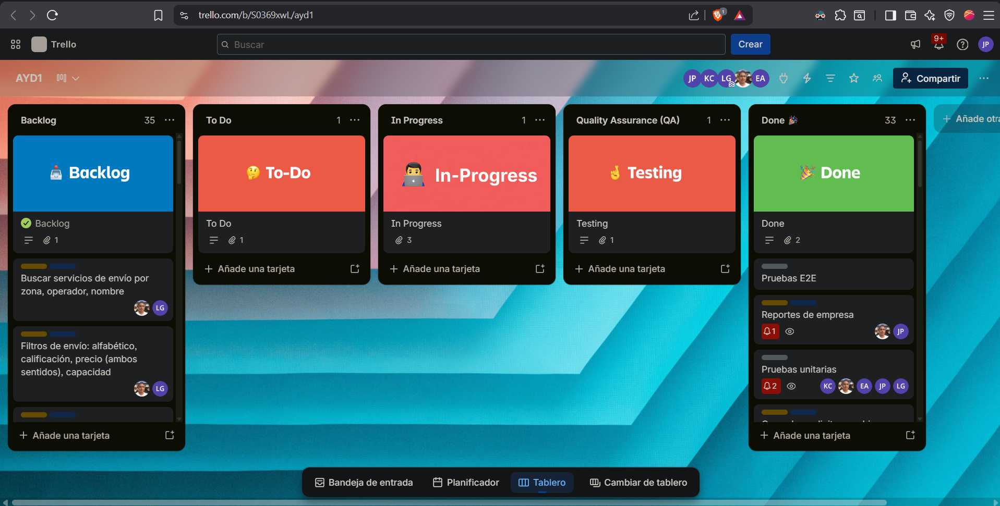
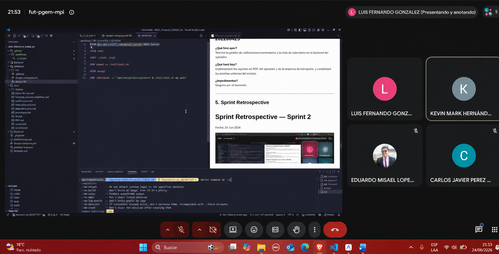
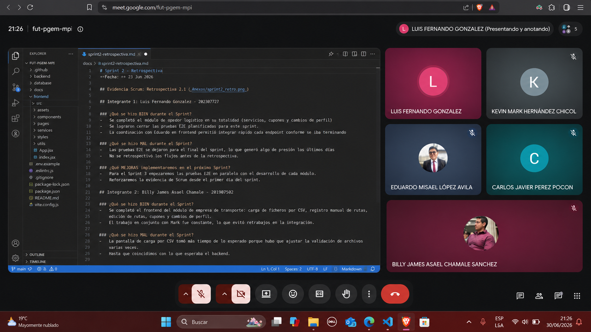

# **SCRUM**
## **1. Creacion de Product Backlog:**

[Tablero](https://trello.com/invite/b/6a2cd807bfdeb612aeb5c9a7/ATTI652b2e578fae0edca261724193a917beB5291EB6/ayd1)

## **2. Sprint Planning — Sprint 3**

#### **Datos de la Reunión:**

- Fecha: 24/06/2026
- Duracion: 2 Horas
- Plataforma: Google Meet
- Fin Sprint: 29/06/2026

---

#### **Roles Presentes:**
- **Scrum Master:** Luis Fernando Gonzalez - 202307727
- **Product Owner:** Kevin Mark Hernández Chicol - 202001053
- **Dev Team:**
    - Carlos Javier Pérez Pocón - 202206425
    - Eduardo Misael López Avila - 202100147
    - Billy James Asael Chamale Sanchez - 201907502

---

## **3. Sprint Backlog — Sprint 3**

### Técnica de estimación: Planning Poker (escala de Fibonacci)

Para este último sprint, se evaluaron los requerimientos pendientes de la rúbrica final, estimando el esfuerzo necesario para completar los módulos de clientes, los reportes de administración, las vistas pendientes de operadores/empresas y los ajustes globales de UI/UX.

---

### Resumen del Sprint Backlog

| HU / TT | Historia / Requisito (resumen) | Story Points | Prioridad | Asignado | Estado |
|----|---------------------|:---:|:---:|---|:---:|
| HU-23 | Cliente: Buscar servicios de envío con filtros (zona, operador, capacidad, etc.) | 5 | Alta | Luis | Completado |
| HU-24 | Cliente: Buscar servicios de transporte, filtros y programación con 24h anticipación | 5 | Alta | Mark | Completado |
| HU-25 | Cliente: Gestión de pagos (Validación Luhn, métodos simulados) y sugerencias cruzadas | 8 | Alta | Mark | Completado |
| HU-26 | Cliente: Carrito persistente, cancelar reservaciones, calificaciones y reportes | 8 | Alta | Luis | Completado |
| HU-27 | Admin: Gestión de reportes y cambios en perfiles | 5 | Alta | Javier + Luis | Completado |
| HU-28 | Admin: Visualización de información general y reportes globales | 8 | Alta | Luis + Mark + Javier | Completado |
| HU-29 | Operador: Responder calificaciones, calendario de envíos y reportes PDF | 8 | Media | Javier | Completado |
| HU-30 | Empresa: Cancelar/suspender rutas (notificar correos) y reportes PDF | 5 | Media | Mark + Javier | Completado |
| TT-04 | UI/UX: Principios de Nielsen, validaciones, mensajes claros y diseño consistente | 8 | Alta | Eduardo + Billy | Completado |
| TT-05 | Implementación final de Arquitectura CI/CD y despliegue | 5 | Alta | Todo el equipo | Completado |

**Total comprometido:** 65 pts · **Completado al cierre del Sprint:** 65 pts

---

### Detalle de Tareas Asignadas (Según rúbrica)

- **Luis:** Buscador y filtros de envíos, carrito persistente, sistema de calificaciones de envíos/transporte, reportar problemas, cancelar reservaciones, gestión de cambios de perfiles (Admin) y visualización de información (junto a Mark).
- **Mark:** Buscador y filtros de transporte, programar envío (24h sin traslape), sugerencias cruzadas, gestión de pagos (algoritmo de Luhn manual y 2do método), suspender rutas de empresas (con notificaciones) y visualización de información (junto a Luis).
- **Javier:** Gestión de reportes del administrador, ver y responder calificaciones de operadores, calendario de envíos de operadores, y todos los reportes PDF (ganancias, historiales, clientes) tanto para el operador como para la empresa.
- **Eduardo y Billy:** Todo el módulo de UI/UX (Documentación de los 6 principios de Nielsen, mensajes de carga y errores claros, validaciones de formularios, consistencia minimalista y ayuda dentro del sistema).

---

#### **Sprint Goal**
El objetivo de este Sprint final es culminar al 100% los módulos pendientes de la rúbrica. Se debe dejar funcional el flujo completo del cliente (búsqueda, carrito y pagos con Luhn), todos los reportes (PDF y vistas de administrador), la estandarización de la UI/UX cumpliendo los principios de Nielsen, y el despliegue funcional bajo una arquitectura CI/CD.

---

## **4. Daily Scrum**

# Daily Scrum — Sprint 3 — Día 1
Fecha: 25 Jun 2026

## Integrante 1: Luis Fernando Gonzalez
**¿Qué hice ayer?** Preparé las consultas SQL base para la búsqueda de envíos.
**¿Qué haré hoy?** Implementaré el buscador de servicios de envío por zona y operador, además de sus filtros respectivos.
**¿Impedimentos?** Ninguno.

## Integrante 2: Billy James Asael Chamale
**¿Qué hice ayer?** Estructuré la base de la documentación UI/UX.
**¿Qué haré hoy?** Junto con Eduardo, revisaremos todas las vistas del proyecto para aplicar los 6 principios de Nielsen y estandarizar colores.
**¿Impedimentos?** Ninguno.

## Integrante 3: Eduardo Misael López Avila
**¿Qué hice ayer?** Coordiné con Billy los lineamientos de diseño.
**¿Qué haré hoy?** Empezaré a implementar los mensajes de carga, confirmaciones y errores claros en los formularios ya existentes.
**¿Impedimentos?** Ninguno.

## Integrante 4: Kevin Mark Hernández Chicol
**¿Qué hice ayer?** Analicé cómo implementar la validación manual del algoritmo de Luhn.
**¿Qué haré hoy?** Desarrollaré el buscador de servicios de transporte y la funcionalidad de programar envíos sin traslapes.
**¿Impedimentos?** Ninguno.

## Integrante 5: Carlos Javier Pérez Pocón
**¿Qué hice ayer?** Revisé las librerías necesarias para la generación de reportes PDF.
**¿Qué haré hoy?** Desarrollaré la vista de calendario de envíos programados para el operador logístico y la gestión de reportes del admin.
**¿Impedimentos?** Ninguno.

---

# Daily Scrum — Sprint 3 — Día 2
Fecha: 26 Jun 2026

## Integrante 1: Luis Fernando Gonzalez
**¿Qué hice ayer?** Terminé los filtros de servicios de envío.
**¿Qué haré hoy?** Trabajaré en la persistencia del carrito de compras (que se mantenga al cerrar sesión) y en cancelar reservaciones.
**¿Impedimentos?** Ninguno.

## Integrante 2: Billy James Asael Chamale
**¿Qué hice ayer?** Aplicamos la consistencia minimalista en los componentes principales.
**¿Qué haré hoy?** Documentar los principios de Nielsen e implementar la sección de "ayuda accesible" dentro del sistema.
**¿Impedimentos?** Ninguno.

## Integrante 3: Eduardo Misael López Avila
**¿Qué hice ayer?** Añadí validaciones de formularios y confirmaciones antes de eliminar registros.
**¿Qué haré hoy?** Continuaré puliendo la UI/UX del proceso de pago y apoyaré a Billy con las evidencias de Nielsen.
**¿Impedimentos?** Ninguno.

## Integrante 4: Kevin Mark Hernández Chicol
**¿Qué hice ayer?** Terminé el buscador de transporte y programación.
**¿Qué haré hoy?** Implementar la gestión de pagos (tarjeta simulada y Luhn) y las sugerencias cruzadas entre envíos y transporte.
**¿Impedimentos?** El algoritmo de Luhn requirió pruebas extra, pero ya está funcional.

## Integrante 5: Carlos Javier Pérez Pocón
**¿Qué hice ayer?** Terminé el calendario y la gestión de reportes.
**¿Qué haré hoy?** Me enfocaré 100% en todos los reportes PDF del operador logístico (ganancias, historiales y calificaciones).
**¿Impedimentos?** Ninguno.

---

# Daily Scrum — Sprint 3 — Día 3
Fecha: 27 Jun 2026

*(En este día, Luis completó las calificaciones y reportes de problemas; Mark finalizó la suspensión de rutas con notificaciones; Javier concluyó los reportes PDF de las empresas; y Eduardo/Billy finalizaron la auditoría completa de UI/UX. El equipo en conjunto comenzó a trabajar en las pruebas E2E finales y la configuración de CI/CD).*

---

## **5. Sprint Retrospective**

# Sprint Retrospective — Sprint 3
Fecha: 29 Jun 2026

## Resumen del Equipo

**¿Qué se hizo BIEN durante el Sprint?**
La división del trabajo fue sumamente precisa. Asignar los requerimientos funcionales críticos (pagos, búsquedas, carritos) a Luis y Mark, los reportes/PDF a Javier, y concentrar a Eduardo y Billy en estandarizar toda la interfaz (UI/UX y Nielsen), permitió que el proyecto subiera drásticamente de calidad sin que nadie se estorbara en el código. El sistema de pagos con la validación de Luhn quedó muy bien implementado.

**¿Qué se hizo MAL durante el Sprint?**
Ajustar la persistencia del carrito de compras trajo algunos retos de sincronización con la base de datos cuando el usuario cerraba la pestaña. Además, la generación de PDFs tuvo problemas de formato en la primera versión que requirieron ajustar márgenes manualmente.

**¿Qué MEJORAS nos llevamos como equipo?**
Separar de forma clara las tareas funcionales de las tareas de usabilidad/diseño fue un acierto enorme. Para futuros proyectos, buscaremos aplicar los principios de heurística y accesibilidad (Nielsen) desde el inicio del proyecto en lugar de dejar la estandarización para el último sprint, lo que ahorrará refactorizaciones visuales de último minuto.